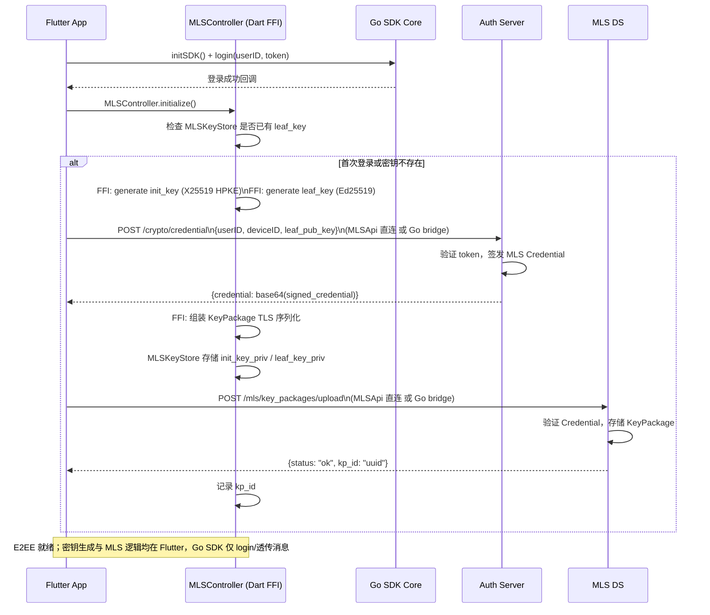
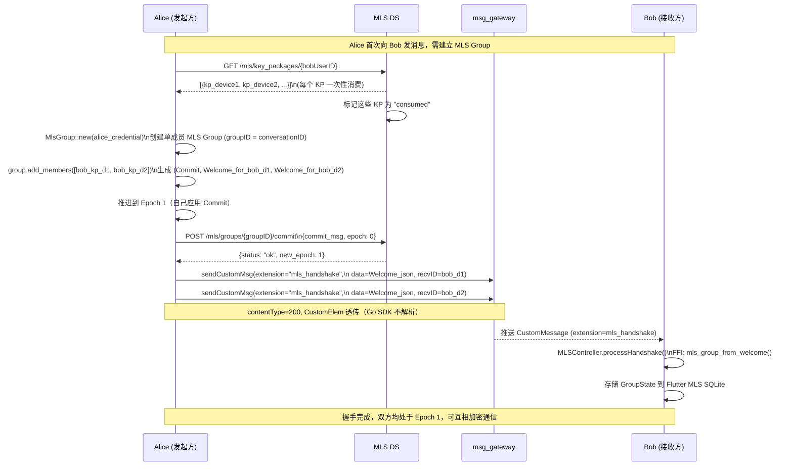
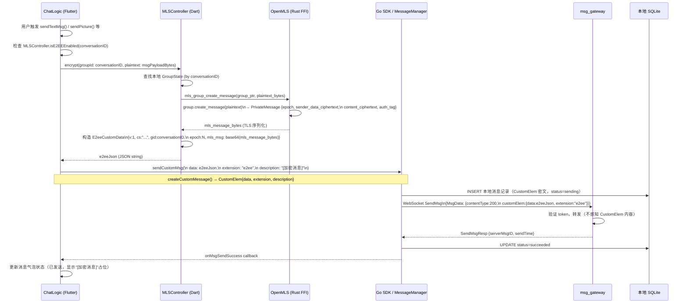
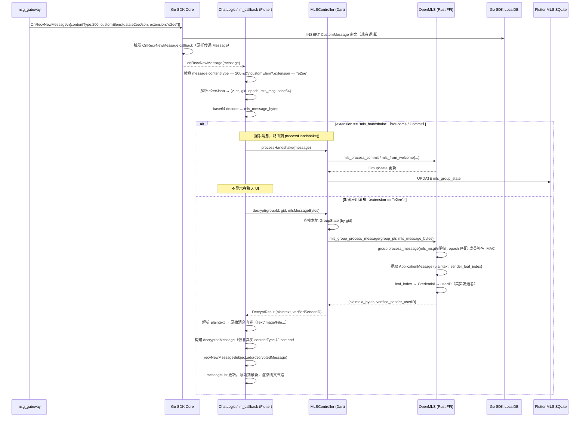
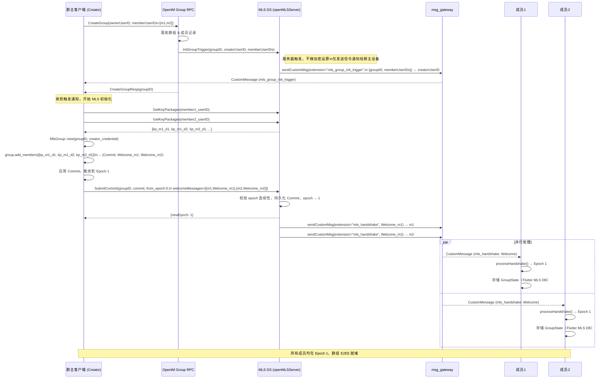
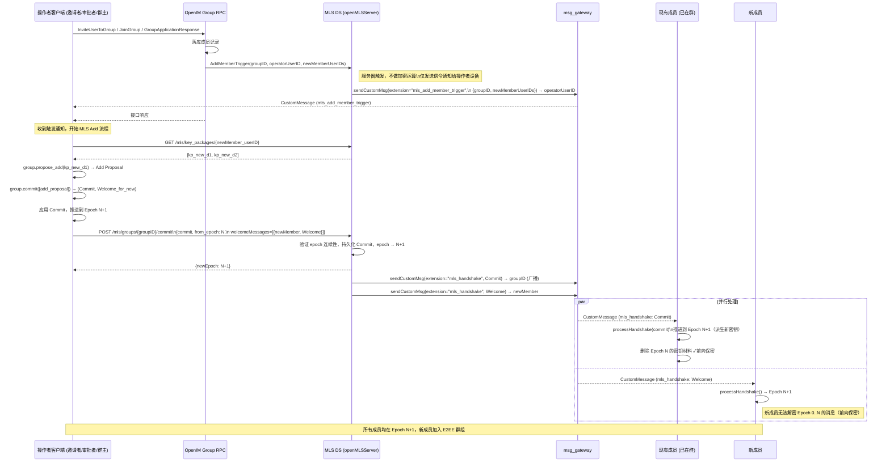
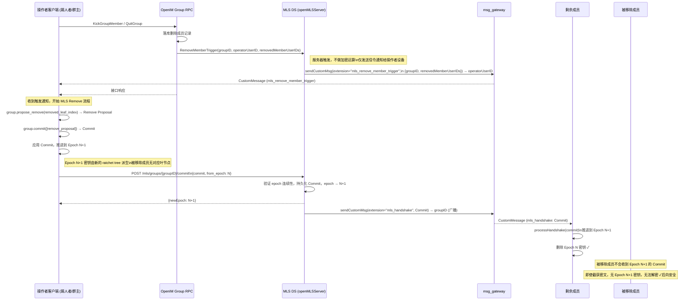
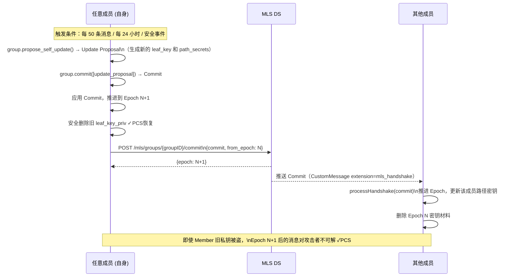
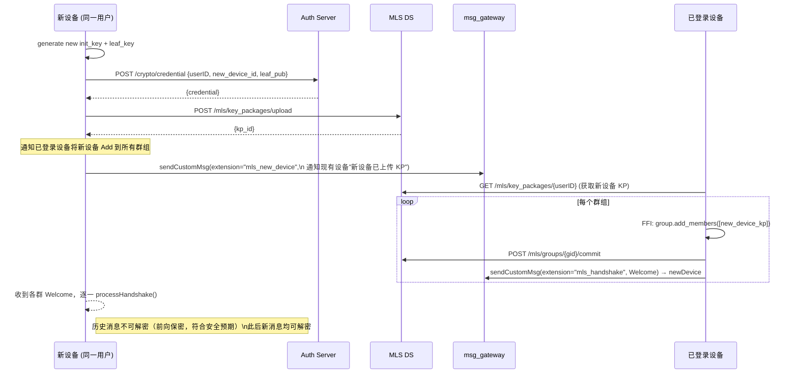

# OpenMLS 端到端加密详细方案设计

> **文档版本**：v1.3  
> **日期**：2026-06-06（v1.3：补充服务器驱动的成员加入/移除 MLS 触发机制；更新 §4.6 §4.7 时序图；新增 §5.1 Trigger RPC 说明；更新 §9 extension 表）  
> **项目**：OpenIM Flutter Enterprise  
> **协议基础**：[MLS RFC 9420](https://www.rfc-editor.org/rfc/rfc9420)  
> **参考实现**：[OpenMLS](https://github.com/openmls/openmls)（Rust，经第三方安全审计）

---

## 目录

1. [背景与目标](#1-背景与目标)
2. [MLS 协议核心概念](#2-mls-协议核心概念)
3. [整体架构](#3-整体架构)
4. [时序图](#4-时序图)
   - 4.1 [设备注册与 KeyPackage 上传](#41-设备注册与-keypackage-上传)
   - 4.2 [1:1 会话建立（首次握手）](#42-11-会话建立首次握手)
   - 4.3 [消息加密发送](#43-消息加密发送)
   - 4.4 [消息接收与解密](#44-消息接收与解密)
   - 4.5 [群组创建与成员初始化](#45-群组创建与成员初始化)
   - 4.6 [群成员加入（Add）](#46-群成员加入add)
   - 4.7 [群成员移除（Remove）](#47-群成员移除remove)
   - 4.10 [成员变更触发机制汇总](#410-成员变更触发机制汇总)
   - 4.8 [密钥轮换（PCS Update）](#48-密钥轮换pcs-update)
   - 4.9 [新设备登录同步](#49-新设备登录同步)
5. [后端接口详细说明](#5-后端接口详细说明)
   - 5.1 [MLS Delivery Service（新增）](#51-mls-delivery-service新增)
   - 5.2 [Auth Server 扩展接口](#52-auth-server-扩展接口)
   - 5.3 [现有接口变更说明](#53-现有接口变更说明)
6. [数据结构定义](#6-数据结构定义)
7. [客户端集成方案](#7-客户端集成方案)
8. [密钥存储设计](#8-密钥存储设计)
9. [ContentType 约定](#9-contenttype-约定)
10. [安全属性分析](#10-安全属性分析)
11. [实施路线图](#11-实施路线图)
12. [风险与缓解措施](#12-风险与缓解措施)

---

## 1. 背景与目标

### 1.1 现状

当前 OpenIM Flutter Enterprise 消息传输：

- 消息体**明文存储于服务器**，服务器可读取全部内容
- `openim-sdk-core/internal/crypto/` 存在 Virgil E3Kit 相关钩子，但**未在 Flutter 层激活**
- `initSDK` 中 `isNeedEncryption: false`，传输层加密亦未开启
- 消息结构中已有 `IsEncryption` / `InEncryptStatus` 字段，为后续加密预留

### 1.2 目标

| 目标 | 说明 |
|------|------|
| **端到端加密** | 服务器仅转发密文，无法获知消息内容 |
| **前向保密（FS）** | 历史密钥泄露不影响过去消息的安全性 |
| **后向安全（PCS）** | 私钥泄露后，经过密钥轮换恢复安全 |
| **群组扩展性** | 群组密钥协商复杂度 O(log N)，支持大群 |
| **多设备支持** | 同一用户多设备均可解密，独立叶节点 |
| **最小服务器改动** | msg_gateway、OpenIM REST 几乎不变 |

### 1.3 选型理由：MLS vs 其他方案

| 方案 | 群组复杂度 | 前向保密 | 后向安全 | 多设备 | 标准化 |
|------|-----------|---------|---------|-------|-------|
| **MLS (RFC 9420)** | O(log N) | ✅ | ✅ | ✅ 原生 | IETF 标准 |
| Signal Protocol | O(N) | ✅ | ✅ | ⚠️ 需额外 | 事实标准 |
| Virgil E3Kit | O(N) | ⚠️ 部分 | ❌ | ✅ | 私有 |
| 自研 AES-GCM | O(1) | ❌ | ❌ | 需自实现 | 无 |

---

## 2. MLS 协议核心概念

```
KeyPackage       —— 设备公钥包（HPKE init_key + Ed25519 leaf_key + Credential）
Credential       —— 将 userID/deviceID 与签名公钥绑定的服务器颁发证书
Ratchet Tree     —— 二叉树结构，叶节点为每个成员设备，内节点存路径密钥
Epoch            —— 每次成员变更（Add/Remove/Update）后推进，派生全新对称密钥
Proposal         —— 成员变更意向（Add/Remove/Update），需 Commit 才生效
Commit           —— 确认并应用若干 Proposal，推进 Epoch，广播给所有成员
Welcome          —— Commit 后向新成员发送的加密初始化包，含 ratchet tree 快照
MLSMessage       —— 加密应用消息（PrivateMessage），携带 epoch + 密文
HPKE             —— Hybrid Public Key Encryption，基于 X25519-HKDF-SHA256 + AES-128-GCM
```

### 密钥派生链

```
init_secret
    │  (KDF + commit_secret)
    ▼
epoch_secret
    ├─► sender_data_secret   (加密发送者身份，PrivateMessage 中隐藏真实发送者)
    ├─► encryption_secret    (消息内容加密根密钥)
    │       └─► per-leaf ratchet → per-message key+nonce (用后即删)
    ├─► exporter_secret      (外部导出，如媒体加密)
    ├─► authentication_secret
    └─► membership_key       (验证成员资格)
```

---

## 3. 整体架构

```
┌─────────────────────────────────────────────────────────────────────────┐
│                          Flutter App Layer                               │
│                                                                          │
│  ┌──────────────┐    ┌─────────────────────┐    ┌──────────────────┐   │
│  │  ChatLogic   │───▶│   MLSController     │───▶│  MLSKeyStore     │   │
│  │ (chat_logic) │    │ (Dart FFI wrapper)  │    │(secure_storage)  │   │
│  └──────┬───────┘    └──────────┬──────────┘    └──────────────────┘   │
│         │                       │                                        │
│         │ sendCustomMsg          │ Dart FFI (dart:ffi)                   │
│         │ (extension="e2ee")     ▼                                        │
│         │             ┌──────────────────┐                               │
│         │             │  libopenmls.so / │                               │
│         │             │  openmls.xcfwk   │  ← OpenMLS Rust 编译产物      │
│         │             └──────────────────┘                               │
└─────────┼───────────────────────────────────────────────────────────────┘
          │ OpenIM SDK (Go → dart bridge)
┌─────────┼──────────────────────────────────────────────────────────────┐
│         │   Go SDK Core (openim-sdk-core)                               │
│  ┌──────▼───────┐    ┌──────────────────┐    ┌──────────────────────┐  │
│  │MessageManager│    │  ConversationMgr  │    │   LocalDB (SQLite)   │  │
│  │ (send/recv)  │    │  (不变)           │    │   (消息持久化)        │  │
│  └──────┬───────┘    └──────────────────┘    └──────────────────────┘  │
│         │  WebSocket SendMsg / RecvMsg（CustomElem 透传，不解析密文）     │
└─────────┼──────────────────────────────────────────────────────────────┘
          │ WebSocket / HTTPS
┌─────────▼──────────────────────────────────────────────────────────────┐
│                         Server Layer                                     │
│                                                                          │
│  ┌───────────────┐  ┌──────────────────┐  ┌──────────────────────────┐ │
│  │  msg_gateway  │  │  MLS DS (新增)   │  │  Auth Server (扩展)      │ │
│  │ (不变，仅转发)│  │  KeyPkg + Commit │  │  Credential 颁发         │ │
│  └───────────────┘  └──────────────────┘  └──────────────────────────┘ │
│                                                                          │
│  ┌───────────────────────────────────────────────────────────────────┐  │
│  │         OpenIM REST API（用户/群组/好友 CRUD，不变）                │  │
│  └───────────────────────────────────────────────────────────────────┘  │
└─────────────────────────────────────────────────────────────────────────┘
```

**核心原则：**
- **MLS 加密/解密在 Flutter 层**：`MLSController` 通过 `dart:ffi` 直接调用编译好的 OpenMLS Rust 静态库，
- 发送加密消息使用 **`sendCustomMsg`**，`CustomElem.extension = "e2ee"`，密文放入 `CustomElem.data`
- Go SDK Core 的 `MessageManager` 透传 `CustomElem`，**不感知也不处理**密文内容
- `msg_gateway` 只看到 CustomMessage 密文 blob，零感知消息内容
- MLS DS 是唯一新增服务，负责 KeyPackage 分发和 Commit 有序广播
- 现有 OpenIM REST、WebSocket 协议字段**不变**，仅 `CustomElem.data` 改为密文

---

## 4. 时序图

### 4.1 设备注册与 KeyPackage 上传



**说明：**
- **密钥生成、KeyPackage 组装、私钥存储均在 Flutter 层**（`MLSController` + `MLSKeyStore`），不在 openim-sdk-core 内实现
- MLS DS / Auth 的 HTTP 可由 Flutter `MLSApi` 直连，或复用 openim-sdk-core `internal/crypto` 的 Go bridge（见 §7.1）
- 每个设备每次登录后检查 KeyPackage 是否仍有效（未被消费），若已被消费则重新上传
- Credential 有效期建议 30 天，到期前 App 自动续签
- 每个用户应上传至少 `max_devices * 5` 份 KeyPackage（防止消费耗尽）

---

### 4.2 1:1 会话建立（首次握手）



---

### 4.3 消息加密发送



**要点：**
- 使用 **`sendCustomMsg`** 而非 `sendMessage`：OpenIM SDK 的 `CustomMessage`（contentType=200）透传 `CustomElem`，Go SDK Core **不解析也不修改** `CustomElem.data` 内容
- `CustomElem.extension = "e2ee"` 作为 E2EE 消息的唯一标识，接收方通过此字段识别并路由到 `MLSController.decrypt()`
- `CustomElem.data` 存储 JSON 封装的 TLS 序列化 `MLSMessage`（见 §6.1）；`description` 用于离线推送预览，显示 `"[加密消息]"`
- OpenMLS Rust 函数通过 **`dart:ffi`** 直接调用，无需经过 Go SDK CGO 层
- 服务器、中间节点对密文完全透明，仅做路由转发

---

### 4.4 消息接收与解密



**异常处理：**

| 情况 | 处理方式 |
|------|---------|
| epoch 不匹配（落后） | 向 DS 拉取缺失 Commit，重放后重新解密 |
| epoch 不匹配（超前） | 缓存消息到 `mls_message_cache`，等待 Commit 追上后解密 |
| 成员签名验证失败 | 丢弃消息，记录安全日志，上报服务器 |
| GroupState 不存在 | 向 DS 请求 Welcome 重新初始化（设备恢复场景） |
| JSON 解析失败 / extension 缺失 | 降级为普通 CustomMessage 处理，显示原始 data |
| FFI Panic（Rust unwind） | `catch_unwind` 捕获，Dart 侧显示"消息无法解密" |

---

### 4.5 群组创建与成员初始化

> **触发方**：服务器。OpenIM 群组 RPC 在 `CreateGroup` 成功落库后，自动调用 MLS DS 的 `InitGroupTrigger`，将初始化任务推送至群主所有在线设备。客户端**无需感知**何时应该启动 MLS 初始化流程——一切由服务器驱动。



**关键设计说明：**

| 点 | 说明 |
|----|------|
| **服务器触发** | `CreateGroup` 落库后立即调用 `InitGroupTrigger`，确保 MLS 初始化与群组创建原子绑定，无需客户端主动发起 |
| **加密操作仍在客户端** | 服务器仅发送信令（不参与 MLS 密钥运算），群主设备收到触发后完成所有 HPKE/MLS 计算，E2EE 属性不受影响 |
| **Welcome 由 DS 分发** | `SubmitCommit` 接收 `welcomeMessages` 列表，DS 负责点对点推送 Welcome 到各成员设备，群主无需直接联系每个成员 |
| **KP 缺失处理** | 若某成员无可用 KeyPackage，客户端记录 `pending_member`，待该成员上传 KP 后通过 4.6 Add 流程补充加入 |

---

### 4.6 群成员加入（Add）

> **触发方**：服务器。OpenIM 群组 RPC 在成员加入成功落库后，自动调用 MLS DS 的 `AddMemberTrigger`，将加人任务推送至操作者（邀请者/审批者/群主）的所有在线设备。客户端无需感知何时应该执行 Add-Commit——一切由服务器驱动。

触发场景：

| OpenIM 接口 | 触发接收方 |
|---|---|
| `InviteUserToGroup`（管理员邀请） | 邀请者（opUserID） |
| `JoinGroup`（用户自主入群） | 群主（owner） |
| `GroupApplicationResponse`（审批通过） | 审批者（opUserID） |



---

### 4.7 群成员移除（Remove）

> **触发方**：服务器。OpenIM 群组 RPC 在成员移除成功落库后，自动调用 MLS DS 的 `RemoveMemberTrigger`，将 Remove-Commit 任务推送至操作者（踢人者/群主）的所有在线设备。操作者设备提交 Remove-Commit，群 epoch 轮换，被移除成员失去后续消息的解密能力。

触发场景：

| OpenIM 接口 | 触发接收方 |
|---|---|
| `KickGroupMember`（踢人） | 踢人者（opUserID） |
| `QuitGroup`（主动退群） | 群主（owner） |



---

### 4.10 成员变更触发机制汇总

服务器在每次成员变更时向特定设备发送 MLS 信令触发通知，使客户端自动执行对应的 MLS Commit 操作，无需客户端主动感知时机。

| OpenIM 接口 | 触发 RPC | extension | 通知接收方 | 客户端动作 |
|---|---|---|---|---|
| `CreateGroup` | `InitGroupTrigger` | `mls_group_init_trigger` | 创建者 | 批量 Add 成员 + Welcome + SubmitCommit |
| `InviteUserToGroup` | `AddMemberTrigger` | `mls_add_member_trigger` | 邀请者（opUserID） | 获取新成员 KP + Add Commit + Welcome |
| `JoinGroup`（自主入群） | `AddMemberTrigger` | `mls_add_member_trigger` | 群主（owner） | 获取新成员 KP + Add Commit + Welcome |
| `GroupApplicationResponse`（审批通过） | `AddMemberTrigger` | `mls_add_member_trigger` | 审批者（opUserID） | 获取新成员 KP + Add Commit + Welcome |
| `KickGroupMember` | `RemoveMemberTrigger` | `mls_remove_member_trigger` | 踢人者（opUserID） | Remove Commit + SubmitCommit |
| `QuitGroup`（主动退群） | `RemoveMemberTrigger` | `mls_remove_member_trigger` | 群主（owner） | Remove Commit + SubmitCommit |
| `DismissGroup`（解散群） | — | — | — | MLS DS 直接清除群状态（`DeleteGroup`）|

**设计原则**：
- 所有触发消息均为 fire-and-log（不阻塞 Group RPC 响应）
- 通知走 notification channel（不进历史、不计未读），仅到达操作者的在线设备
- MLS 加密运算仍完全在客户端进行，服务器零感知密钥内容


### 4.8 密钥轮换（PCS Update）



---

### 4.9 新设备登录同步



---

## 5. 后端接口详细说明

### 5.1 MLS Delivery Service（新增）

MLS DS 是独立部署的轻量微服务，负责：KeyPackage 存储分发、Commit 有序广播、Welcome 路由。

**服务基础路径**：`/mls`（独立微服务或挂载于现有 chat API 服务下）

---

#### `POST /mls/key_packages/upload`

**功能**：设备上传自己的 KeyPackage，供他人发起加密会话时消费。

**请求头**：
```
Authorization: Bearer {imToken}
Content-Type: application/json
```

**请求体**：
```json
{
  "user_id": "user123",
  "device_id": "device_abc",
  "platform": "iOS",
  "key_package": "base64(TLS序列化的 KeyPackage)",
  "ciphersuite": "MLS_128_DHKEMX25519_AES128GCM_SHA256_Ed25519",
  "credential_type": "basic",
  "expires_at": 1780000000
}
```

**字段说明**：

| 字段 | 类型 | 必填 | 说明 |
|------|------|------|------|
| user_id | string | 是 | 用户 ID，与 token 中一致 |
| device_id | string | 是 | 设备唯一标识（安装 UUID 或平台设备指纹） |
| platform | string | 是 | iOS / Android / Web |
| key_package | string | 是 | TLS 序列化的 KeyPackage，base64 编码 |
| ciphersuite | string | 是 | 固定值，双方必须一致 |
| credential_type | string | 否 | basic（默认）或 x509 |
| expires_at | int64 | 否 | Unix 时间戳，KP 过期时间；不填默认 30 天 |

**响应**：
```json
{
  "code": 0,
  "msg": "ok",
  "data": {
    "kp_id": "kp_uuid_xxx",
    "total_count": 5
  }
}
```

**错误码**：

| code | 含义 |
|------|------|
| 4001 | Credential 签名验证失败 |
| 4002 | KeyPackage 格式错误 |
| 4003 | 超出单设备最大 KP 数量限制（默认 20） |

---

#### `GET /mls/key_packages/{user_id}`

**功能**：获取指定用户所有在线设备的 KeyPackage（每个 KP **一次性消费**）。发起加密会话时调用。

**请求头**：
```
Authorization: Bearer {imToken}
```

**查询参数**：

| 参数 | 类型 | 说明 |
|------|------|------|
| exclude_device_id | string | 排除自己的设备（可选） |
| count_per_device | int | 每设备取几份，默认 1 |

**响应**：
```json
{
  "code": 0,
  "data": {
    "user_id": "user456",
    "key_packages": [
      {
        "kp_id": "kp_uuid_1",
        "device_id": "device_ios",
        "platform": "iOS",
        "key_package": "base64(...)",
        "consumed": false
      },
      {
        "kp_id": "kp_uuid_2",
        "device_id": "device_android",
        "platform": "Android",
        "key_package": "base64(...)",
        "consumed": false
      }
    ]
  }
}
```

**注意**：
- 此接口调用后，DS 将对应 KP 标记为 `consumed`，不会再返回给其他请求
- 若用户 KP 耗尽（`key_packages` 为空），调用方应通过其他渠道（如系统消息）通知对方补充 KP
- DS 应在 KP 剩余数量低于阈值（如 3 份/设备）时，主动推送通知给对应用户补充

---

#### `GET /mls/key_packages/count/{user_id}`

**功能**：查询指定用户各设备的 KeyPackage 剩余数量（不消费）。

**响应**：
```json
{
  "code": 0,
  "data": {
    "user_id": "user123",
    "devices": [
      {"device_id": "device_ios", "available_count": 8},
      {"device_id": "device_android", "available_count": 3}
    ],
    "total_available": 11
  }
}
```

---

#### `POST /mls/key_packages/refresh`

**功能**：批量补充 KeyPackage（当剩余量低于阈值时客户端主动调用）。与 `upload` 语义相同，单次可上传多份。

**请求体**：
```json
{
  "user_id": "user123",
  "device_id": "device_ios",
  "key_packages": [
    "base64(kp1)",
    "base64(kp2)",
    "base64(kp3)"
  ]
}
```

---

#### `POST /mls/groups/{group_id}/commit`

**功能**：提交 MLS Commit 消息，DS 负责有序广播给群内所有成员。这是 MLS 成员变更（Add/Remove/Update）的核心接口。

**请求体**：
```json
{
  "group_id": "group_xxx",
  "sender_user_id": "user123",
  "sender_device_id": "device_ios",
  "from_epoch": 5,
  "commit_message": "base64(TLS序列化的 MLSMessage(Commit))",
  "welcome_messages": [
    {
      "recipient_user_id": "user456",
      "recipient_device_id": "device_android",
      "welcome_message": "base64(TLS序列化的 Welcome)"
    }
  ]
}
```

**字段说明**：

| 字段 | 类型 | 必填 | 说明 |
|------|------|------|------|
| group_id | string | 是 | MLS Group ID，与 OpenIM conversationID 对应 |
| sender_user_id | string | 是 | 发起 Commit 的用户 |
| from_epoch | uint64 | 是 | 发送时客户端认为的当前 epoch；DS 以此做乐观并发控制 |
| commit_message | string | 是 | TLS 序列化的 Commit MLSMessage，base64 |
| welcome_messages | array | 否 | 仅在有新成员时携带（Add Proposal 对应的 Welcome） |

**响应**：
```json
{
  "code": 0,
  "data": {
    "new_epoch": 6,
    "sequence_number": 42,
    "broadcast_count": 5
  }
}
```

**错误码**：

| code | 含义 | 客户端处理 |
|------|------|---------|
| 4010 | epoch 冲突（已有更新的 Commit） | 拉取最新 epoch 后重试 |
| 4011 | 发送者不在群组中 | 重新获取 Welcome 初始化 |
| 4012 | Commit 验证失败 | 放弃，上报错误 |

**有序性保证**：
- DS 对每个 `group_id` 维护单写锁，同时只有一个 Commit 被处理
- `from_epoch` 必须等于 DS 当前存储的 epoch，否则拒绝并返回 4010
- Commit 写入 Redis Stream，支持成员断线重连后按序拉取

---

#### `GET /mls/groups/{group_id}/commits`

**功能**：成员重连后，拉取本地 epoch 之后的全部 Commit（用于追赶状态）。

**查询参数**：

| 参数 | 类型 | 说明 |
|------|------|------|
| since_epoch | uint64 | 从此 epoch 之后（不含）开始返回 |
| limit | int | 最多返回条数，默认 50 |

**响应**：
```json
{
  "code": 0,
  "data": {
    "group_id": "group_xxx",
    "commits": [
      {
        "epoch": 6,
        "sequence_number": 42,
        "commit_message": "base64(...)",
        "sender_user_id": "user123",
        "created_at": 1748573100
      }
    ],
    "current_epoch": 6,
    "has_more": false
  }
}
```

---

#### `POST /mls/groups/{group_id}/welcome`

**功能**：向新成员/新设备发送 Welcome（可独立于 Commit 调用，用于补发）。

**请求体**：
```json
{
  "group_id": "group_xxx",
  "sender_user_id": "user123",
  "recipients": [
    {
      "user_id": "user789",
      "device_id": "device_new",
      "welcome_message": "base64(Welcome)"
    }
  ]
}
```

DS 通过 msg_gateway 向各接收方推送 **CustomMessage**（`contentType=200`，`customElem.extension="mls_handshake"`），与客户端 `sendCustomMsg` 路径一致。

---

#### `GET /mls/groups/{group_id}/state`

**功能**：查询群组当前 MLS 状态（调试/恢复用）。

**响应**：
```json
{
  "code": 0,
  "data": {
    "group_id": "group_xxx",
    "current_epoch": 8,
    "member_count": 12,
    "last_commit_at": 1748573100,
    "created_at": 1748560000
  }
}
```

---

#### `DELETE /mls/groups/{group_id}`

**功能**：群组解散时清理 MLS DS 侧数据（由服务端群组解散事件触发，非客户端调用）。

---

#### `POST /mls/groups/{group_id}/init_trigger`（内部 RPC）

**功能**：由 OpenIM `Group RPC` 在 `CreateGroup` 成功后调用，触发群主设备执行 MLS 初始化流程。

**触发方**：Group RPC（服务器内部 gRPC 调用，非客户端直接调用）

**行为**：向群主所有在线设备发送 `mls_group_init_trigger` CustomMessage，携带 `{groupID, memberUserIDs}`。

---

#### `POST /mls/groups/{group_id}/add_member_trigger`（内部 RPC）

**功能**：由 OpenIM `Group RPC` 在成员加入后调用，触发操作者设备执行 MLS Add-Commit + Welcome 流程。

**触发方**：Group RPC（服务器内部 gRPC 调用）

**触发场景**：`InviteUserToGroup`、`JoinGroup`、`GroupApplicationResponse`（通过）

**行为**：向操作者（邀请者/审批者/群主）所有在线设备发送 `mls_add_member_trigger` CustomMessage，携带 `{groupID, newMemberUserIDs}`。

---

#### `POST /mls/groups/{group_id}/remove_member_trigger`（内部 RPC）

**功能**：由 OpenIM `Group RPC` 在成员退出/被踢后调用，触发操作者设备执行 MLS Remove-Commit 流程，轮换群 epoch。

**触发方**：Group RPC（服务器内部 gRPC 调用）

**触发场景**：`KickGroupMember`、`QuitGroup`

**行为**：向操作者（踢人者/群主）所有在线设备发送 `mls_remove_member_trigger` CustomMessage，携带 `{groupID, removedMemberUserIDs}`。

---

### 5.2 Auth Server 扩展接口

#### `POST /crypto/credential`

**功能**：Auth Server 为设备颁发 MLS Credential。Credential 将 `userID + deviceID` 与设备签名公钥绑定，其他成员通过 Credential 验证消息发送者身份。

**请求头**：
```
Authorization: Bearer {chatToken}
Content-Type: application/json
```

**请求体**：
```json
{
  "user_id": "user123",
  "device_id": "device_abc_uuid",
  "platform": "iOS",
  "leaf_public_key": "base64(Ed25519公钥，32字节)",
  "client_version": "3.8.3"
}
```

**响应**：
```json
{
  "code": 0,
  "data": {
    "credential": "base64(BasicCredential TLS序列化)",
    "credential_type": "basic",
    "issued_at": 1748573100,
    "expires_at": 1751165100,
    "issuer": "openim-auth.example.com"
  }
}
```

**Credential 内容结构**（TLS 编码前的明文）：
```
BasicCredential {
  identity: bytes  // userID:deviceID:platform
}
// 由 Auth Server 私钥（Ed25519）对整个 KeyPackage 的 tbs 部分签名
```

**注意**：
- Auth Server 需维护一个 Ed25519 根签名密钥对
- 公钥需在 `/.well-known/mls-credentials` 端点公开，客户端初始化时拉取并固定（Certificate Pinning）
- Credential 有效期 30 天，客户端提前 7 天续签

---

#### `GET /crypto/credential/verify`

**功能**：验证 Credential 有效性（供其他客户端或 DS 调用，也可由客户端本地验证）。

**查询参数**：
```
credential=base64(credential)
```

**响应**：
```json
{
  "code": 0,
  "data": {
    "valid": true,
    "user_id": "user123",
    "device_id": "device_abc_uuid",
    "expires_at": 1751165100
  }
}
```

---

#### `GET /crypto/root_public_key`

**功能**：返回 Auth Server 用于签发 Credential 的根公钥（客户端启动时拉取，用于本地验证 Credential）。

**响应**：
```json
{
  "code": 0,
  "data": {
    "public_key": "base64(Ed25519根公钥，32字节)",
    "key_id": "v1",
    "algorithm": "Ed25519"
  }
}
```

---

### 5.3 现有接口变更说明

#### `POST /msg/send_msg`（msg_gateway）

**变更**：**无变更**。E2EE 消息以 `contentType=200`（CustomMessage）发送，`MsgData.customElem.data` 存放密文 JSON，服务器完全透传，与普通自定义消息无区别。

**受影响字段**：

| 字段 | 变更前 | 变更后 |
|------|-------|-------|
| `content_type` | 101 (Text) 等 | **200 (CustomMessage)**（E2EE 消息，旧客户端显示 description 占位） |
| `custom_elem.data` | 业务 JSON | base64 或 JSON 封装的 TLS 序列化 `MLSMessage PrivateMessage` |
| `custom_elem.extension` | 业务扩展字段 | `"e2ee"` 或 `"mls_handshake"` |
| `custom_elem.description` | 自定义 | `"[加密消息]"`（用于推送预览） |
| 其余字段 | 不变 | 不变 |

#### `POST /msg/get_history_message`（msg_gateway）

**变更**：无变更。历史消息以密文返回，由客户端本地解密后展示。

**注意**：若用户 GroupState 不存在（如重装），历史密文消息将无法解密，这是 E2EE 的预期行为。建议 UI 提示"无法解密的加密消息"。

---

## 6. 数据结构定义

### 6.1 MLSMessage Wrapper（客户端封装层）

```json
{
  "v": 1,
  "cs": "MLS_128_DHKEMX25519_AES128GCM_SHA256_Ed25519",
  "gid": "conversationID_xxx",
  "epoch": 5,
  "mls_msg": "base64(TLS序列化的 MLSMessage)"
}
```

此 JSON 作为 **`CustomElem.data`** 字段值（`contentType=200` 的 CustomMessage），**不是** `MsgData.content` 明文字段。

### 6.2 本地 GroupState 存储结构（Flutter MLS SQLite）

> **与 openim-sdk-core 分离**：下列表位于 Flutter 侧 MLS 专用库（sqflite / drift）。Go SDK 的 LocalDB 仅按现有逻辑持久化 CustomMessage（含密文 `customElem`），**不存储** `mls_group_state`。

```sql
CREATE TABLE mls_group_state (
  group_id        TEXT PRIMARY KEY,
  conversation_id TEXT NOT NULL,
  epoch           INTEGER NOT NULL DEFAULT 0,
  group_state     BLOB NOT NULL,  -- OpenMLS 序列化的 MlsGroup，AES-256-GCM 加密
  member_count    INTEGER NOT NULL DEFAULT 1,
  created_at      INTEGER NOT NULL,
  updated_at      INTEGER NOT NULL,
  last_commit_seq INTEGER NOT NULL DEFAULT 0
);

CREATE TABLE mls_pending_proposals (
  id              TEXT PRIMARY KEY,
  group_id        TEXT NOT NULL,
  proposal        BLOB NOT NULL,
  proposal_ref    TEXT NOT NULL,
  created_at      INTEGER NOT NULL
);

CREATE TABLE mls_message_cache (
  msg_client_id   TEXT PRIMARY KEY,
  group_id        TEXT NOT NULL,
  epoch           INTEGER NOT NULL,
  mls_ciphertext  BLOB NOT NULL,
  cached_at       INTEGER NOT NULL
  -- 缓存超前 epoch 的消息，等 Commit 到达后重新解密
);
```

### 6.3 本地 KeyStore 结构（flutter_secure_storage）

```
key: "mls_init_key_{device_id}"      value: base64(X25519私钥, 32字节)
key: "mls_leaf_key_priv_{device_id}" value: base64(Ed25519私钥, 32字节)
key: "mls_leaf_key_pub_{device_id}"  value: base64(Ed25519公钥, 32字节)
key: "mls_credential_{device_id}"    value: base64(TLS序列化的BasicCredential)
key: "mls_root_pub_key"              value: base64(Auth Server根公钥)
key: "mls_db_encryption_key"         value: base64(AES-256-GCM密钥, 32字节，用于加密GroupState数据库)
```

所有 key 存储于：
- **iOS**：Keychain，`kSecAttrAccessibleWhenUnlockedThisDeviceOnly`
- **Android**：Android Keystore + EncryptedSharedPreferences

### 6.4 消息识别约定（CustomElem.extension）

E2EE 消息复用 OpenIM 现有 **CustomMessage**（contentType = 200），不新增 contentType 常量。区分逻辑完全由 `CustomElem.extension` 字段承载；**消息收发路径** openim-sdk-core 无需改动（MLS DS HTTP 可选 bridge，见 §7.1）：

| extension 值 | 含义 | 是否显示 UI | 处理方 |
|---|---|---|---|
| `"e2ee"` | MLS 加密应用消息（PrivateMessage） | 是（解密后） | `MLSController.decrypt()` |
| `"mls_handshake"` | MLS 握手消息（Welcome / Commit / Proposal） | **否** | `MLSController.processHandshake()` |
| `"mls_new_device"` | 新设备已上传 KeyPackage 的通知 | **否** | 触发已登录设备批量 Add + Welcome |
| 其他值 | 业务自定义消息（红包、名片等） | 视业务 | 现有 CustomMsg 处理逻辑 |

`CustomElem.data` 格式（E2EE 消息）：

```json
{
  "v": 1,
  "cs": "MLS_128_DHKEMX25519_AES128GCM_SHA256_Ed25519",
  "gid": "conversationID_xxx",
  "epoch": 5,
  "mls_msg": "base64(TLS序列化的 MLSMessage PrivateMessage)"
}
```

`CustomElem.data` 格式（MLS 握手消息）：

```json
{
  "v": 1,
  "type": "welcome",
  "gid": "conversationID_xxx",
  "mls_msg": "base64(TLS序列化的 Welcome 或 MLSMessage Commit)"
}
```

`CustomElem.description`（所有 E2EE 消息统一）：
- 加密消息：`"[加密消息]"` — 用于离线推送通知预览
- 握手消息：`""` （空字符串，不触发推送）

**迁移兼容性**：旧版客户端收到 `extension="e2ee"` 的 CustomMessage，将显示 `description` 中的 `"[加密消息]"` 占位文本，不会崩溃；新版客户端正常解密展示。

---

## 7. 客户端集成方案

### 7.1 改动文件清单

#### Flutter 层（主要改动集中于此）

| 文件 | 改动类型 | 说明 |
|------|---------|------|
| `lib/core/controller/im_controller.dart` | 修改 | `login()` 成功后调用 `MLSController.initialize()` 上传 KeyPackage |
| `lib/core/im_callback.dart` | 修改 | `onRecvNewMessage` 中识别 `extension=="e2ee"` 和 `"mls_handshake"` 并路由到 `MLSController` |
| `lib/im/pages/chat_logic.dart` | 修改 | 各 `sendXxxMsg()` 方法前插入 E2EE 加密拦截；改为调用 `sendCustomMsg()` |
| `openim_common/lib/src/apis.dart` | 新增 | `MLSApi` 类：KP 上传/获取、Commit 提交、Welcome 发送、Credential 申请 |
| `openim_common/lib/src/urls.dart` | 新增 | MLS DS 端点路径常量（`/mls/key_packages/...`, `/mls/groups/...` 等） |
| `lib/core/mls_controller.dart` | **新增** | Dart FFI 封装 OpenMLS Rust 库；GroupState 缓存管理；Epoch 追踪；encrypt/decrypt/processHandshake |
| `lib/core/mls_key_store.dart` | **新增** | `flutter_secure_storage` 封装；init_key / leaf_key 生命周期管理 |
| `lib/core/mls_ffi_bindings.dart` | **新增** | `dart:ffi` 生成的 C bindings，对应 OpenMLS Rust 导出函数签名 |
| `pubspec.yaml` | 修改 | 新增依赖：`flutter_secure_storage`、`ffi`；配置 `assets/` 中的 `.so` / `.xcframework` 路径 |
| `android/app/src/main/jniLibs/` | 新增 | OpenMLS 编译产物：`libopenmls.so`（arm64-v8a / x86_64） |
| `ios/Frameworks/openmls.xcframework/` | 新增 | OpenMLS 编译产物：iOS/macOS universal xcframework |

#### Go SDK Core 层（**最小改动，仅新增 HTTP 客户端**）

| 模块 | 改动 | 说明 |
|------|------|------|
| `internal/crypto/crypto.go` | **扩展** | 新增 `UploadKeyPackage / FetchKeyPackages / PostCommit / GetCommits / PostWelcome` HTTP 方法，供 Flutter 通过 Go bridge 调用 MLS DS |
| `internal/conversation_msg/api.go` | **不变** | 发送路径不变，CustomElem 透传，不解析加密内容 |
| `sdk_struct/sdk_struct.go` | **不变** | 不新增 ContentType 常量（沿用 contentType=200 CustomMessage） |
| ~~`internal/mls/`~~ | **不新增** | MLS 加解密与 GroupState 不在 Go 层实现 |

> **架构决策**：MLS Rust FFI 编译为平台原生库（`.so` / `.xcframework`），由 Flutter `dart:ffi` 直接加载。openim-sdk-core **可选**在 `internal/crypto` 提供 MLS DS HTTP bridge；若 Flutter `MLSApi` 直连，则 Go 层可零改动。

### 7.2 加密拦截点（伪代码）

#### 7.2.1 发送端：`chat_logic.dart` 中的通用加密拦截

```dart
// lib/im/pages/chat_logic.dart

/// 所有发送方法（sendTextMsg / sendPicture / sendVideo / sendFile 等）
/// 在调用 _sendMessage 前，先经此方法做 E2EE 包装。
/// 原有 _sendMessage 方法签名和内部逻辑保持不变。
Future<void> _sendMessageWithE2EE(
  Message message, {
  String? userId,
  String? groupId,
}) async {
  if (!MLSController.instance.isE2EEEnabled(conversationID)) {
    // 非 E2EE 会话，走原有路径
    return _sendMessage(message, userId: userId, groupId: groupId);
  }

  // 1. 将原始 Message 序列化为明文 payload
  final plaintext = utf8.encode(jsonEncode({
    'contentType': message.contentType,
    'content': message.content,
    // 保留 quoteMessage、atUserList 等扩展字段
    'ex': message.ex,
  }));

  // 2. Flutter 层直接调用 OpenMLS Rust FFI 加密
  final mlsMessageBytes = await MLSController.instance.encrypt(
    groupId: conversationID,   // MLS Group ID = conversationID
    plaintext: plaintext,
  );

  // 3. 构造 E2EE Custom Data JSON
  final e2eeData = jsonEncode({
    'v': 1,
    'cs': 'MLS_128_DHKEMX25519_AES128GCM_SHA256_Ed25519',
    'gid': conversationID,
    'epoch': MLSController.instance.currentEpoch(conversationID),
    'mls_msg': base64Encode(mlsMessageBytes),
  });

  // 4. 用 sendCustomMsg 发送，extension="e2ee"
  //    sendCustomMsg 内部调用 createCustomMessage → _sendMessage
  sendCustomMsg(
    data: e2eeData,
    extension: 'e2ee',
    description: '[加密消息]',  // 离线推送通知预览文本
  );
}
```

> **集成方式**：将现有各 `sendXxxMsg()` 方法末尾的 `_sendMessage(message)` 替换为 `_sendMessageWithE2EE(message)`，无需修改 `_sendMessage` 本身。

#### 7.2.2 接收端：`im_callback.dart` 中的解密分发

```dart
// lib/core/im_callback.dart

void onRecvNewMessage(Message message) {
  // --- 服务器触发：群组初始化（CreateGroup 后） ---
  if (message.contentType == 200 &&
      message.customElem?.extension == 'mls_group_init_trigger') {
    MLSController.instance.onGroupInitTrigger(message).catchError((e) {
      Logger.print('[MLS] onGroupInitTrigger error: $e');
    });
    return;
  }

  // --- 服务器触发：成员加入（Invite/Join/Approve 后） ---
  if (message.contentType == 200 &&
      message.customElem?.extension == 'mls_add_member_trigger') {
    MLSController.instance.onAddMemberTrigger(message).catchError((e) {
      Logger.print('[MLS] onAddMemberTrigger error: $e');
    });
    return;
  }

  // --- 服务器触发：成员移除（Kick/Quit 后） ---
  if (message.contentType == 200 &&
      message.customElem?.extension == 'mls_remove_member_trigger') {
    MLSController.instance.onRemoveMemberTrigger(message).catchError((e) {
      Logger.print('[MLS] onRemoveMemberTrigger error: $e');
    });
    return;
  }

  // --- 新设备 KeyPackage 已上传通知 ---
  if (message.contentType == 200 &&
      message.customElem?.extension == 'mls_new_device') {
    MLSController.instance.onNewDeviceNotification(message);
    return;
  }

  // --- E2EE 握手消息（Welcome / Commit / Proposal）---
  if (message.contentType == 200 &&
      message.customElem?.extension == 'mls_handshake') {
    // 不显示在聊天 UI，交给状态机处理
    MLSController.instance.processHandshake(message).catchError((e) {
      Logger.print('[MLS] processHandshake error: $e');
    });
    return;
  }

  // --- E2EE 加密应用消息 ---
  if (message.contentType == 200 &&
      message.customElem?.extension == 'e2ee') {
    _decryptAndDispatch(message);
    return;
  }

  // --- 非 E2EE，走原有逻辑 ---
  recvNewMessageSubject.addSafely(message);
}

Future<void> _decryptAndDispatch(Message encryptedMsg) async {
  try {
    // 1. 解析 CustomElem.data
    final e2eeData = jsonDecode(encryptedMsg.customElem!.data!) as Map<String, dynamic>;
    final mlsMessageBytes = base64Decode(e2eeData['mls_msg'] as String);
    final groupId = e2eeData['gid'] as String;

    // 2. Flutter 层直接调用 OpenMLS Rust FFI 解密
    final result = await MLSController.instance.decrypt(
      groupId: groupId,
      mlsMessageBytes: mlsMessageBytes,
    );
    // result.plaintext: 原始 payload JSON bytes
    // result.verifiedSenderID: 经 MLS Credential 验证的真实发送者 userID

    // 3. 还原原始 Message
    final payload = jsonDecode(utf8.decode(result.plaintext)) as Map<String, dynamic>;
    final decryptedMsg = encryptedMsg.copyWith(
      contentType: payload['contentType'] as int,
      content: payload['content'] as String?,
      ex: payload['ex'] as String?,
      sendID: result.verifiedSenderID,   // 使用 MLS 验证的发送者，防止伪造
    );

    recvNewMessageSubject.addSafely(decryptedMsg);
  } catch (e, stack) {
    Logger.print('[MLS] decrypt failed: $e\n$stack');
    // 解密失败降级：显示无法解密占位消息
    recvNewMessageSubject.addSafely(encryptedMsg.copyWith(
      contentType: 200,
      customElem: CustomElem()
        ..extension = 'e2ee_failed'
        ..description = '[消息无法解密，请升级客户端]',
    ));
  }
}
```

#### 7.2.3 MLSController 核心接口（Dart FFI 封装骨架）

```dart
// lib/core/mls_controller.dart

import 'dart:ffi';
import 'dart:io';
import 'package:ffi/ffi.dart';
import 'mls_ffi_bindings.dart';   // dart:ffi 自动生成的 C bindings

class MLSController {
  static final MLSController instance = MLSController._();
  MLSController._();

  late final MlsFfiBindings _ffi;

  /// 加载平台对应的 OpenMLS 动态库
  void init() {
    final lib = Platform.isAndroid
        ? DynamicLibrary.open('libopenmls.so')
        : DynamicLibrary.process();  // iOS: 静态链接到主可执行文件
    _ffi = MlsFfiBindings(lib);
    // 初始化 Rust 日志 / panic handler
    _ffi.mls_init();
  }

  bool isE2EEEnabled(String conversationID) {
    // 查本地 SQLite: mls_group_state 是否存在且 epoch >= 0
    return _groupStateExists(conversationID);
  }

  int currentEpoch(String conversationID) {
    return _loadGroupState(conversationID)?.epoch ?? 0;
  }

  /// 加密一条消息，返回 TLS 序列化的 MLSMessage bytes
  Future<Uint8List> encrypt({
    required String groupId,
    required Uint8List plaintext,
  }) async {
    // 在 Dart Isolate 中执行 FFI（避免阻塞 UI 线程）
    return Isolate.run(() {
      final groupStateBytes = _loadGroupStateBytes(groupId);
      // mls_group_create_message(group_state_ptr, plaintext_ptr, ...) → mls_message_bytes
      final result = _ffi.mls_group_create_message(
        groupStateBytes.toNativePtr(),
        plaintext.toNativePtr(),
        plaintext.length,
      );
      _saveGroupStateBytes(groupId, result.updatedGroupState);
      return result.mlsMessageBytes;
    });
  }

  /// 解密一条 MLSMessage，返回明文 bytes 和已验证的发送者 userID
  Future<DecryptResult> decrypt({
    required String groupId,
    required Uint8List mlsMessageBytes,
  }) async {
    return Isolate.run(() {
      final groupStateBytes = _loadGroupStateBytes(groupId);
      final result = _ffi.mls_group_process_message(
        groupStateBytes.toNativePtr(),
        mlsMessageBytes.toNativePtr(),
        mlsMessageBytes.length,
      );
      _saveGroupStateBytes(groupId, result.updatedGroupState);
      return DecryptResult(
        plaintext: result.plaintext,
        verifiedSenderID: result.senderIdentity,  // from Credential
      );
    });
  }

  /// 处理 MLS 握手消息（Welcome / Commit）
  Future<void> processHandshake(Message message) async { /* ... */ }
}

class DecryptResult {
  final Uint8List plaintext;
  final String verifiedSenderID;
  DecryptResult({required this.plaintext, required this.verifiedSenderID});
}
```

> **Rust FFI 导出函数约定**（OpenMLS 侧需实现的 C ABI）：
>
> ```c
> // 初始化 panic handler 和日志
> void mls_init(void);
>
> // 加密：返回 {mls_message_bytes, updated_group_state}
> MlsEncryptResult mls_group_create_message(
>     const uint8_t* group_state, size_t gs_len,
>     const uint8_t* plaintext,   size_t pt_len);
>
> // 解密：返回 {plaintext, sender_identity_str, updated_group_state}
> MlsDecryptResult mls_group_process_message(
>     const uint8_t* group_state,  size_t gs_len,
>     const uint8_t* mls_message,  size_t msg_len);
>
> // Welcome → 初始化 GroupState
> MlsGroupState mls_group_from_welcome(
>     const uint8_t* welcome_bytes, size_t len,
>     const uint8_t* ratchet_tree,  size_t rt_len);
> ```

---

## 8. 密钥存储设计

### 8.1 密钥分层

```
Level 0: 设备硬件安全（Keychain / Android Keystore）
    └── mls_db_encryption_key（加密 GroupState 数据库的 AES-256-GCM 主密钥）
    └── mls_leaf_key_priv（Ed25519 私钥，消息签名）
    └── mls_init_key（X25519 私钥，一次性，用后删除）

Level 1: Flutter MLS 加密 SQLite（用 L0 密钥加密，与 Go SDK 消息库分离）
    └── GroupState（OpenMLS 序列化，含 epoch 密钥树）
    └── Pending Proposals
    └── Message Cache（超前 epoch 的缓存密文）

Level 2: 内存（仅运行时）
    └── 当前 epoch 的 per-message key+nonce（用后立即归零）
```

### 8.2 密钥生命周期

| 密钥 | 生成时机 | 删除时机 | 存储位置 |
|------|---------|---------|---------|
| `init_key_priv` | 首次登录 / KP 刷新 | KP 被消费（对方建立会话）后立即删除 | Keychain |
| `leaf_key_priv` | 首次登录 / Update Commit | 下一次 Update Commit 生效后删除旧密钥 | Keychain |
| `epoch_secret` | Commit 推进 | 下一个 Commit 生效后，立即安全擦除 | 内存 → GroupState |
| `per-message key` | 每条消息加/解密 | 加/解密完成后立即归零 | 内存 |
| `GroupState` | 群组初始化 | 退群 / 群解散 / 用户登出 | Flutter MLS 加密 SQLite |

---

## 9. E2EE 消息识别与路由约定

E2EE 消息**不新增 ContentType**，统一使用 OpenIM 原有 **ContentType = 200（CustomMessage）**，通过 `CustomElem.extension` 字段区分：

| ContentType | extension 值 | 名称 | 处理方式 | 是否显示在 UI |
|-------------|--------------|------|---------|-------------|
| 101 | —— | Text | 现有逻辑（向后兼容，非 E2EE 会话） | 是 |
| 102 | —— | Picture | 现有逻辑 | 是 |
| 200 | `"e2ee"` | **加密应用消息** | `MLSController.decrypt()` → 解密后按原 contentType 渲染 | 是（解密后） |
| 200 | `"mls_handshake"` | **MLS 握手消息** | `MLSController.processHandshake()` → 状态机，不显示 | **否** |
| 200 | `"mls_new_device"` | **新设备 KP 通知** | 触发已登录设备 Add 新设备到各群 | **否** |
| 200 | `"redpacket"` 等 | 业务自定义消息 | 现有 CustomMsg 逻辑（不变） | 视业务 |
| 200 | `"e2ee_failed"` | 解密失败占位 | 显示"[消息无法解密，请升级客户端]" | 是（降级提示） |

**openim-sdk-core 消息路径无需变更**：`MessageManager` 透传 CustomElem；E2EE 识别与解密在 Flutter `onRecvNewMessage` 完成。MLS DS HTTP 可选经 Go `internal/crypto` bridge（§7.1）。

---

## 10. 安全属性分析

| 属性 | 是否满足 | 实现机制 |
|------|---------|---------|
| **机密性** | ✅ | AES-128-GCM per-message 加密，服务器零感知 |
| **完整性** | ✅ | AEAD（Authenticated Encryption）+ Ed25519 叶节点签名 |
| **发送者认证** | ✅ | 每条消息携带 sender_data（HMAC 派生），接收方通过 Credential 验证身份 |
| **前向保密（FS）** | ✅ | 每 Epoch 独立派生密钥，旧密钥 Commit 后立即擦除 |
| **后向安全（PCS）** | ✅ | 成员定期 Update Proposal，重新密钥化路径，恢复 PCS |
| **服务器盲知** | ✅ | PrivateMessage 隐藏发送者，服务器只见加密 blob |
| **群组可扩展性** | ✅ | Ratchet Tree O(log N) 成员管理 |
| **多设备** | ✅ | 每台设备为独立叶节点，并行解密 |
| **重放攻击防护** | ✅ | per-message 序号 + 独一无二 nonce（基于 generation counter） |
| **成员资格保密** | ⚠️ 部分 | 基本 MLS 不隐藏 ratchet tree，可选 Private Group State 扩展 |

---

## 11. 实施路线图

### Phase 1：基础设施（4-6 周）

| 任务 | 负责层 | 产出 |
|------|-------|------|
| 集成 OpenMLS crate，编译 Android/iOS FFI 库 | Native / Flutter | `libopenmls.so` + `.xcframework` |
| `MLSController` + `mls_ffi_bindings.dart`（dart:ffi） | Flutter | Flutter 侧 MLS 加解密能力 |
| KeyPackage 生命周期：生成/上传/消费/刷新 | Flutter + Server | MLS DS 核心 API；生成在 Flutter FFI |
| openim-sdk-core MLS DS HTTP bridge（**可选**） | Go SDK | `internal/crypto/crypto.go` 扩展 |
| MLS Credential 颁发（Auth Server 新增端点） | Server | `/crypto/credential` |
| 本地密钥存储（`flutter_secure_storage` 封装） | Flutter | `MLSKeyStore` |
| Flutter MLS SQLite（GroupState / cache） | Flutter | `mls_group_state` 等表 |
| MLS DS 服务骨架（Go，~2000 行） | Server | MLS DS v0.1 |

### Phase 2：1:1 消息加密（3-4 周）

| 任务 | 负责层 | 产出 |
|------|-------|------|
| `MLSController`：init/add/encrypt/decrypt | Flutter Dart | `mls_controller.dart` |
| `ChatLogic` 集成：发送拦截 + 接收解密 | Flutter | `chat_logic.dart` 修改 |
| Welcome / Commit 旁路分发 | Flutter + Server | `im_callback.dart` 扩展 |
| 端到端集成测试（Alice ↔ Bob） | QA | 集成测试套件 |
| 多设备同步（新设备 Add + Welcome） | Flutter + Server | 多端 E2EE |

### Phase 3：群组加密（4-5 周）

| 任务 | 负责层 | 产出 |
|------|-------|------|
| 群组 MLS Group 初始化（批量 Add） | Flutter + Server | 群组 E2EE 初始化 |
| 成员 Add/Remove → Commit 广播 + Epoch 推进 | Flutter + Server DS | 成员变更 E2EE |
| Commit 有序性保证（Redis Stream + 版本锁） | Server DS | Commit 队列 |
| 自动 Update 策略（PCS 定时轮换） | Flutter | 后台任务 |
| 群历史消息 UI 处理（加锁图标提示） | Flutter UI | 用户体验 |

### Phase 4：安全加固与发布（2-3 周）

| 任务 | 说明 |
|------|------|
| 设备完整性检测 | 复用现有 `IntegrityReport` API，加入 MLS Credential 绑定 |
| 密钥备份（可选） | 用户密码派生 KEK 加密私钥备份（明确告知丢失不可恢复） |
| 安全审计 | 代码审计 + OpenMLS 官方 fuzz 测试集成 |
| 灰度发布 | Feature flag：`isE2EEEnabled`，按用户组逐步开启 |
| 监控与告警 | Epoch 推进延迟、KP 耗尽、Commit 冲突率 |

---

## 12. 风险与缓解措施

| 风险 | 概率 | 影响 | 缓解措施 |
|------|------|------|---------|
| Commit 竞争导致群组 epoch 分裂 | 中 | 高 | DS 序列化写 + `from_epoch` 乐观锁；客户端重试机制 |
| KeyPackage 耗尽（批量新设备上线） | 低 | 中 | DS 低水位告警（< 3 份/设备），客户端自动后台补充 |
| 旧客户端无法显示加密消息 | 高（过渡期） | 中 | CustomMessage `description="[加密消息]"` 占位；非 E2EE 会话仍用 contentType 101 |
| GroupState 丢失（重装、迁移） | 低 | 高 | 明确产品决策：历史不可恢复（E2EE 预期行为）；可选密码备份 |
| FFI 层 Rust panic 影响 App 稳定性 | 中 | 高 | Rust `catch_unwind`；Dart Isolate 隔离；崩溃上报；降级明文模式 |
| Commit 广播延迟导致消息解密失败 | 中 | 中 | 客户端 epoch 对齐缓冲队列；用户感知延迟 < 500ms |
| 服务器私钥泄露伪造 Credential | 低 | 极高 | Auth Server 签名密钥离线保存；定期轮换；Certificate Transparency |

---

*文档由 Cursor AI 基于 openim-flutter-enterprise 代码库自动生成并持续维护，请在实施前进行人工审阅。*  
*v1.3 更新：服务器驱动 MLS 成员变更触发机制（AddMemberTrigger / RemoveMemberTrigger），覆盖 InviteUserToGroup / JoinGroup / GroupApplicationResponse / KickGroupMember / QuitGroup 全路径。*
