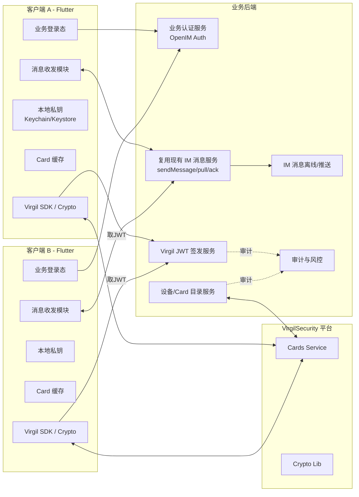
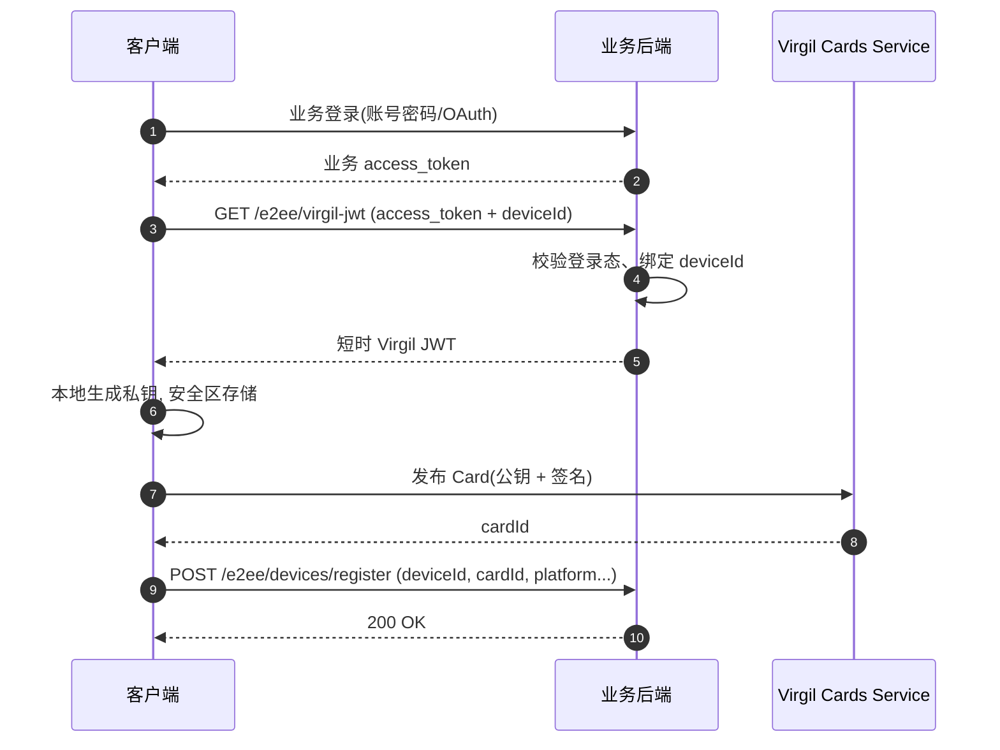
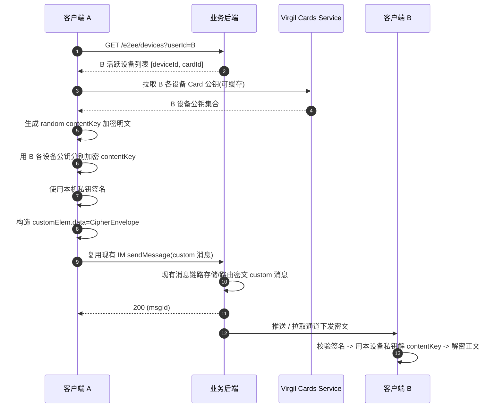
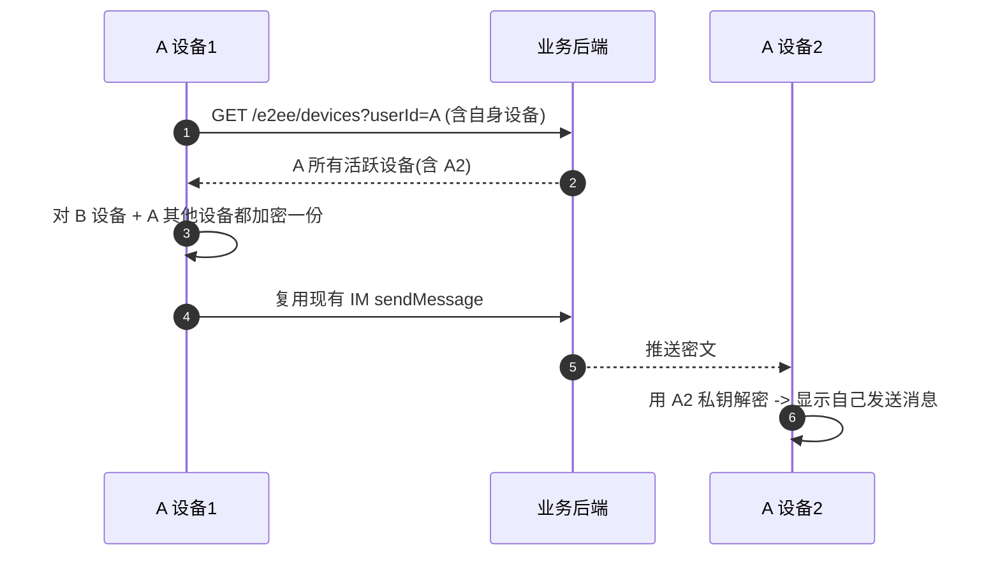
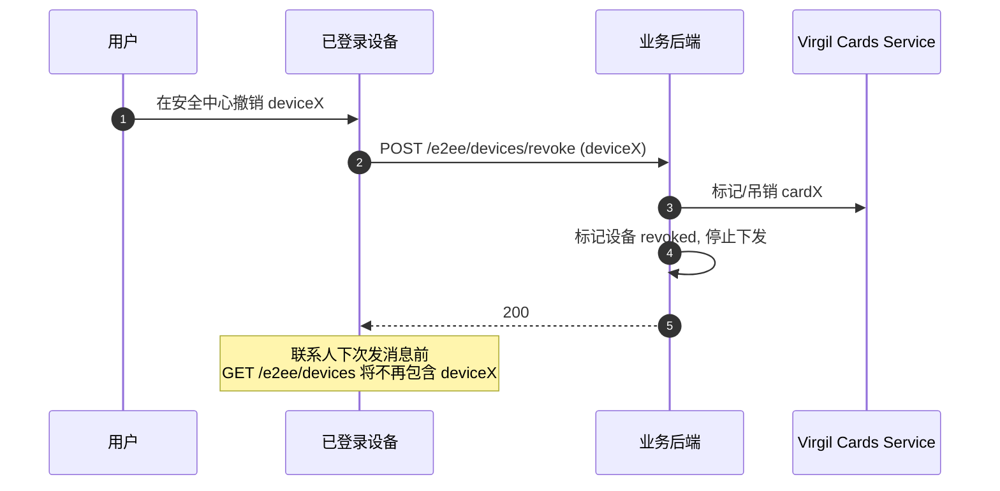
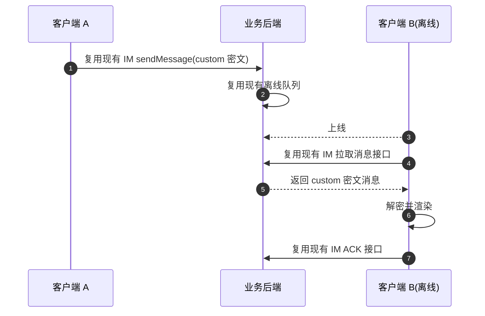

# VirgilSecurity 1v1 E2EE 详细设计方案

## 一、目标与范围

### 目标
- 在 `sok-im-flutter` 现有 IM 链路上，叠加基于 VirgilSecurity（Virgil Crypto + E3Kit 思路）的 1v1 端到端加密。
- 服务端无解密能力，仅转发密文与少量元数据。
- 支持多设备、设备撤销、离线消息、附件密钥分发。

### 范围（首版仅 1v1）
- 文本消息 E2EE
- 附件 `fileKey` 通过 E2EE 通道分发
- 多设备（同一用户多端）
- 设备注册 / 撤销
- 不含群聊（接口字段保留扩展）

### 安全边界
- TLS 保护链路
- E2EE 保护消息正文 + 文件密钥
- 服务端可见：`senderUid / receiverUid / OpenIM conversationID（沿用现有 IM）/ 时间戳 / 长度`
- 服务端不可见：消息明文、附件明文、用户私钥

---

## 二、核心概念与对象模型

- **User**：业务账号 `userId`
- **Device**：设备 `deviceId`，每台设备一对长期密钥
- **VirgilCard**：Virgil 公钥卡（绑定 `userId + deviceId`）
- **VirgilJWT**：由后端签发的访问 Virgil 服务的短时令牌
- **CipherEnvelope**：1v1 消息密文信封（多设备分别加密）
- **OpenIM Conversation**：1v1 会话标识使用现有 IM 的 `conversationID`（`conversationManager.getOneConversation`，**不单独建 E2EE 会话接口**）

建议消息载荷结构（逻辑）：

```text
CipherEnvelope {
  algo: "virgil-e3kit-v1",
  senderDeviceId: "ios_a1",
  recipients: [
    { deviceId: "android_b1", encKey: "BASE64" },
    { deviceId: "ipad_b2",    encKey: "BASE64" }
  ],
  ciphertext: "BASE64",
  signature: "BASE64",
  meta: { v: 1, ts: 169... }
}
```

---

## 三、整体架构图



---

## 四、关键流程时序图

### 4.1 设备初始化（注册身份 + 发布 Card）



### 4.2 A 首次给 B 发消息（1v1 加密发送）



### 4.3 多设备同步（A 自己多端可读）



### 4.4 设备撤销 / 丢失



### 4.5 离线消息



---

## 五、服务端需要完成的功能

### 1) Virgil JWT 签发服务
- 后端持有 Virgil App Private Key。
- 签发短时 JWT（建议 5~15 分钟）。
- JWT 绑定 `userId + deviceId`。
- 加入限流、审计日志。

### 2) 设备与 Card 目录
- 维护 `userId -> [{deviceId, cardId, status, platform, lastSeenAt}]`。
- 支持注册、查询、撤销。
- 可后台与 Virgil Cards Service 做一致性对账。

### 3) 复用现有 IM 消息通道（核心）
- 不新增发送主链路接口，直接复用现有 `sendMessage`/拉取/ACK。
- 服务端将 E2EE 消息视为 `custom` 消息透传与存储（仅密文 + 必要元数据）。
- 保持现有顺序、离线队列、ACK、重试、幂等能力。

### 4) 发送前拉取对端活跃设备（无推送）
- **不做**设备变更 WebSocket/CustomBusiness 推送。
- 客户端在**每次发送 E2EE 消息前**调用 `GET /e2ee/devices?userId={peerUserId}`，以服务端返回的活跃设备列表为准加密。
- 设备 `register` / `revoke` 仅更新目录；联系人侧在下次发送时自然拿到最新列表。

### 5) 附件支持（可选）
- 提供对象存储上传/下载签名 URL。
- fileKey 不存后端，仅走 E2EE 消息通道。

### 6) 安全与合规
- 禁止明文日志。
- 审计关键事件：JWT、设备管理、密文消息。
- 风控异常行为：异常注册、异常签发频率。

---

## 六、客户端需要完成的功能（Flutter）

### 1) 本地密钥与身份
- 首次登录生成私钥。
- 私钥存储到 Keychain/Keystore。
- 卸载重装按新设备处理。

### 2) Virgil SDK 封装层
建议目录：`lib/im/e2ee/virgil/`
- `virgil_jwt_provider.dart`
- `virgil_crypto_service.dart`
- `virgil_card_repo.dart`
- `e2ee_message_codec.dart`
- `e2ee_session_manager.dart`

### 3) 发送前设备拉取（核心）
- **每次**发送 E2EE 消息前：`GET /e2ee/devices?userId={对端}` → 拉取 Card 公钥 → 加密 → `sendMessage`。
- Virgil Card 公钥可短 TTL 内存缓存（如 30s）以降低重复请求；**不以推送失效缓存**，以发送前强制拉取为准。
- 若对端无活跃设备：提示用户，不发送明文。

### 4) 消息状态机改造
- 发送：`plaintext -> encrypting -> encrypted -> sending -> sent`
- 接收：`received_cipher -> decrypting -> decrypted -> rendered`
- 失败：刷新设备列表并重试（限制次数）。

### 5) 多设备一致性
- 发送时为接收方所有活跃设备加密。
- 同时为自己其它活跃设备加密（多端同步）。

### 6) 附件
- 本地生成 fileKey 加密文件再上传。
- fileKey 通过 E2EE 消息分发。

---

## 七、后端接口清单（详细描述）

### 通用约定
- BaseURL: `/api/im-e2ee`
- 鉴权头：
  - `Authorization: Bearer <access_token>`
  - `X-Device-Id: <deviceId>`
  - `X-Request-Id: <requestId>`
- 写接口建议：
  - `Idempotency-Key: <idempotencyKey>`

---

### 1. `POST /v1/virgil/jwt`
**功能**：签发短时 Virgil JWT，供客户端调用 Virgil Cards 等能力。

**Request**
```json
{
  "deviceId": "ios_a1",
  "tokenTtlSec": 600
}
```

**Response 200**
```json
{
  "virgilJwt": "eyJhbGciOi...",
  "identity": "u1001:ios_a1",
  "expiresAt": "2026-05-28T08:30:00Z"
}
```

**错误码**
- `401 UNAUTHORIZED`
- `403 FORBIDDEN_DEVICE_REVOKED`
- `429 RATE_LIMITED`

---

### 2. `POST /v1/e2ee/devices/register`
**功能**：绑定 `deviceId + cardId` 到业务用户。

**Request**
```json
{
  "deviceId": "ios_a1",
  "cardId": "card_01J...",
  "platform": "ios",
  "clientVersion": "1.2.3"
}
```

**Response 201**
```json
{
  "userId": "u1001",
  "deviceId": "ios_a1",
  "cardId": "card_01J...",
  "status": "active",
  "registeredAt": "2026-05-28T08:21:00Z"
}
```

**错误码**
- `400 INVALID_ARGUMENT`
- `409 CONFLICT`

**幂等**
- 同 `(userId, deviceId, cardId)` 重放返回同结果。

---

### 3. `GET /v1/e2ee/devices`
**功能**：查询用户活跃设备和 Card。**发送 E2EE 消息前必调**（每次发送拉取对端最新活跃设备，不依赖推送）。

**Query**
- `userId`（必填）
- `includeRevoked`（可选，默认 false）

**Response 200**
```json
{
  "userId": "u2001",
  "devices": [
    {
      "deviceId": "android_b1",
      "cardId": "card_01K...",
      "platform": "android",
      "status": "active",
      "lastSeenAt": "2026-05-28T08:00:00Z"
    },
    {
      "deviceId": "ipad_b2",
      "cardId": "card_01L...",
      "platform": "ios",
      "status": "active",
      "lastSeenAt": "2026-05-27T14:30:00Z"
    }
  ],
  "version": 17
}
```

---

### 4. `POST /v1/e2ee/devices/revoke`
**功能**：撤销设备；联系人侧在下次发送前拉取设备列表时不再包含该设备。

**Request**
```json
{
  "deviceId": "android_b1",
  "reason": "lost"
}
```

**Response 200**
```json
{
  "deviceId": "android_b1",
  "status": "revoked",
  "revokedAt": "2026-05-28T08:35:00Z"
}
```

**语义**
- 撤销后该设备写请求返回 `403 FORBIDDEN_DEVICE_REVOKED`。
- 不推送变更事件；发送方在下次 `GET /e2ee/devices` 时自动排除已撤销设备。

---

### 5. 复用现有 IM `sendMessage`（不新增消息发送接口）
**功能**：E2EE 发送完全复用现有 IM 发送链路，客户端将密文信封封装进 custom 消息体。

**发送约定**
- 使用现有 `sendMessage(message, userID/groupID, offlinePushInfo, ...)`。
- `message` 必须为 custom 类型，`customElem.data` 存放 `CipherEnvelope`（JSON 字符串）。
- 建议 `customElem.description = "e2ee:v1"`，用于接收侧快速识别。
- 建议 `customElem.extension` 放非敏感元信息（协议版本、兼容标识），禁止放明文。

**CipherEnvelope 示例**
```json
{
  "v": 1,
  "alg": "virgil-e3kit-v1",
  "senderUserId": "u1001",
  "senderDeviceId": "ios_a1",
  "ciphertext": "BASE64",
  "recipients": [
    { "deviceId": "android_b1", "encKey": "BASE64" },
    { "deviceId": "ipad_b2", "encKey": "BASE64" }
  ],
  "sign": "BASE64",
  "msgType": "text"
}
```

**服务端职责**
- 沿用现有消息入库、离线、推送、ACK。
- 不解析明文字段，只按 custom 消息透传。

---

### 6. 复用现有 IM 拉取消息与 ACK 接口
**功能**：接收端仍通过现有消息拉取接口拿消息，通过现有 ACK 接口确认消费。

**接收约定**
- 若 `contentType=custom` 且 `customElem.description=e2ee:v1`，进入 E2EE 解密流程。
- 使用本设备私钥从 `recipients` 中选择自己的 `encKey` 解出会话密钥，再解密 `ciphertext`。
- 解密失败（缺设备密钥/设备已撤销）时，可重新 `GET /e2ee/devices` 后提示用户重发（接收侧不重试自动解密）。

---

### 7. 发送前拉取对端活跃设备（策略说明，无推送接口）

**原则**：不做设备变更推送；以**发送前实时查询**保证 `recipients` 与对端当前活跃设备一致。

**客户端发送流程（每次发 E2EE 消息）**
1. `GET /v1/e2ee/devices?userId={peerUserId}`（`includeRevoked=false`）
2. 若 `devices` 为空 → 中止发送并提示
3. 按返回的 `cardId` 拉取 Virgil Card 公钥（可短 TTL 缓存）
4. 构造 `CipherEnvelope.recipients`（覆盖对端全部活跃设备 + 己方其它活跃设备，若需多端同步）
5. 加密 → `sendMessage`（custom 密文）

**多设备（发送方自己）**
- 发送前额外 `GET /v1/e2ee/devices?userId={self}`，为自身其它活跃设备加密一份，便于多端同步已发消息。

**服务端**
- `GET /e2ee/devices` 仅返回 `status=active` 设备（除非 `includeRevoked=true`）。
- `revoke` 后立即生效；无需向联系人推送。
- 响应中的 `version` 可选，用于客户端调试或短缓存校验，**不可替代发送前拉取**。

**性能建议**
- Card 公钥可内存缓存 30~60s；**设备列表建议每次发送都拉**（或仅在同一会话连续发送时复用上一帧结果，间隔小于 5s）。
- 可对 `GET /e2ee/devices` 做按 `userId` 的网关限流，防刷。

---

### 8. `POST /v1/e2ee/files/upload-url`（可选）
**功能**：返回对象存储上传/下载签名 URL；客户端上传**已加密**文件密文，`fileKey` 仍通过 E2EE 消息通道分发。

**会话标识（不调用 ensure-1v1）**
- 客户端先调 OpenIM：`conversationManager.getOneConversation(sourceID: peerUserId, sessionType: 1)` 取得 `conversationID`。
- 本接口使用该 `openIMConversationID` 做对象路径/鉴权隔离；`peerUserId` 用于校验与当前 1v1 对端一致。

**Request**
```json
{
  "size": 102400,
  "contentType": "application/octet-stream",
  "openIMConversationID": "si_userA_userB",
  "peerUserId": "u2001"
}
```

| 字段 | 必填 | 说明 |
|------|------|------|
| `size` | 是 | 加密后文件字节数 |
| `contentType` | 是 | 建议 `application/octet-stream` |
| `openIMConversationID` | 是 | OpenIM 单聊 `conversationID`，非 E2EE 自建 ID |
| `peerUserId` | 是 | 1v1 对端 `userId`，服务端校验归属 |

**Response 200**
```json
{
  "uploadUrl": "https://...",
  "downloadUrl": "https://...",
  "fileRefId": "file_01J...",
  "expiresAt": "2026-05-28T09:40:00Z"
}
```

**错误码（补充）**
- `400 INVALID_ARGUMENT`（`peerUserId` 与会话不匹配）
- `404 NOT_FOUND`（`openIMConversationID` 不存在或无权访问）

---

## 八、错误码（最小集）

- `UNAUTHORIZED` (401)
- `FORBIDDEN_DEVICE_REVOKED` (403)
- `INVALID_ARGUMENT` (400)
- `IDEMPOTENCY_CONFLICT` (409)
- `MSG_DUPLICATE` (409)
- `RATE_LIMITED` (429)
- `INTERNAL_ERROR` (500)

---

## 九、后端最小数据表（建议）

- `e2ee_devices(user_id, device_id, card_id, status, platform, last_seen_at, version)`
- `e2ee_device_card_history(...)`
- `e2ee_file_refs(file_ref_id, openim_conversation_id, peer_user_id, owner_user_id, size, created_at)`（可选，仅附件签名场景）
- `idempotency_records(...)`

> 消息密文走 OpenIM 现有消息表，E2EE 服务不再维护独立 `e2ee_conversations` / `e2ee_messages` 表。

---

## 十、上线节奏建议

- Phase 1：单聊文本 + 单设备
- Phase 2：多设备同步 + 设备撤销 + 发送前拉取设备
- Phase 3：附件 fileKey E2EE 分发
- Phase 4：审计/风控/灰度/异常恢复

---

## 十一、关键风险与对策

- **Flutter + Virgil SDK 可用性风险**：先做 iOS/Android 双端 PoC，验证 Card、加解密、签名链路。
- **多设备一致性风险**：发送前必须以服务端权威设备列表为准，本地缓存仅优化。
- **撤销窗口风险**：撤销后至对方下次发送前拉取设备前，已发出的密文对方仍可解；服务端须立即阻断 revoked 设备写入。发送方依赖每次 `GET /e2ee/devices` 获取最新列表。
- **服务端越权风险**：复用现有拉取消息接口时，服务端必须限制当前设备仅能获取自己可见消息数据，禁止泄漏其它设备的密钥材料。
- **离线兼容风险**：长离线后设备变更导致部分历史不可解需有客户端提示与重试策略。

