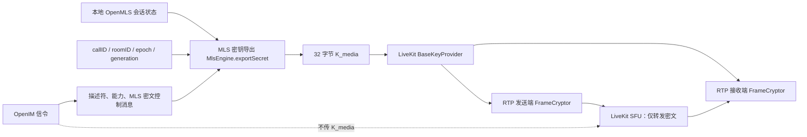

# 音视频通话端到端加密（E2EE）实施计划

> **供智能代理执行：** 必须使用子技能 `superpowers:subagent-driven-development`（推荐）或 `superpowers:executing-plans`，按任务逐项实施本计划。步骤使用复选框（`- [ ]`）语法跟踪进度。

**目标：** 在 Android/iOS 客户端中复用现有 OpenMLS 会话状态，为 LiveKit 音视频轨道启用强制端到端加密，使 OpenIM 服务和 LiveKit SFU 均无法获取媒体明文或媒体密钥。

**架构：** OpenMLS 继续负责会话成员、epoch、PCS 和导出器秘密值（exporter secret）；Flutter 客户端通过 `MlsEngine.exportSecret` 派生每通电话、每次换钥独立的 32 字节媒体密钥，再交给 LiveKit `BaseKeyProvider + E2EEOptions + FrameCryptor` 加解密编码帧。OpenIMSDK/服务端只协调非秘密描述符、能力声明、MLS 加密控制消息、成员授权和换钥状态，绝不生成、保存或下发媒体密钥。

**技术栈：** Flutter/Dart、GetX、OpenMLS 1.4.0、LiveKit Client 2.8.1、flutter_webrtc 1.4.0、OpenIM Flutter SDK 3.8.3+hotfix.10.1（私有定制版）、Android/iOS 原生桥、flutter_test、integration_test。

---

## 1. 执行摘要

### 1.1 当前结论

当前程序没有实现实时音视频媒体 E2EE。

现有通话链路为：

```text
Flutter CallController
  ├─ OpenIMSDK：邀请、接听、挂断、房间状态、LiveKit Token
  └─ LiveKit/WebRTC：采集、编码、发布和订阅音视频
                     ↓
                 LiveKit SFU
```

当前 WebRTC 使用 DTLS-SRTP 保护客户端到 SFU 的传输，但 LiveKit SFU 终止这层加密，仍处于媒体明文信任边界，因此不能称为端到端加密。

直接证据：

- `lib/im/Call/engine/livekit_engine.dart:151-165` 创建 `RoomOptions` 时只有 `adaptiveStream`、`dynacast` 和音频 DTX，没有 `RoomOptions.encryption`、`E2EEOptions` 或 `BaseKeyProvider`。
- `lib/im/Call/controller/call_controller.dart:585-595` 和 `820-829` 的单聊、群聊邀请 `customData` 均为空字符串。
- `lib/im/Call/models/call_session.dart`、`call_token.dart` 只有房间、Token 和会话信息，没有加密方案、MLS epoch、密钥代次或密钥索引。
- 通话模块没有调用 `E2EEOptions`、`FrameCryptor`、`TrackE2EEStateEvent` 或 OpenMLS 导出器。

现有依赖已经具备客户端实现条件：

- `livekit_client` 实际锁定为 `2.8.1`，内置 AES-GCM FrameCryptor。
- `flutter_webrtc` 实际锁定为 `1.4.0`，原生层支持 RTP 发送端/接收端帧加解密。
- `openmls` 实际锁定为 `1.4.0`，公开 `MlsEngine.exportSecret(...)`。
- iOS、Android 无需自行处理 PCM/YUV 原始帧，也无需新增业务原生媒体加密桥。

### 1.2 已确定的产品决策

- 群通话媒体密钥允许当前整个聊天群的 MLS 成员派生，不为实际参会者建立临时 MLS 群。
- E2EE 为强制模式；MLS 未就绪、版本不支持、密钥不一致或 FrameCryptor 失败时禁止接通。
- 禁止静默或自动降级到普通 LiveKit 通话。
- OpenIM 服务和 LiveKit 服务均不得持有媒体密钥。
- E2EE 房间禁用服务端录制、转写、审核、混流、SIP/PSTN 和服务端 AI 媒体处理。
- 第一阶段交付 Android/iOS；Web 和桌面端另行验证。

### 1.3 职责边界

| 组件 | 职责 | 禁止事项 |
|---|---|---|
| Flutter 客户端 | MLS 同步、密钥派生、密钥承诺值、LiveKit 帧加解密、换钥、失败关闭（fail-closed） | 不持久化或记录媒体密钥 |
| OpenMLS | 会话成员身份、epoch、PCS、导出器秘密值 | 不把导出器秘密值暴露给服务端 |
| OpenIMSDK/Core | 通话信令、E2EE 能力、非秘密描述符、MLS 密文控制消息桥接 | 不处理音视频帧，不生成媒体密钥 |
| OpenIM 服务端 | 房间成员授权、Token 门禁、控制消息转发、Commit 分发服务（DS） | 不解密 MLS 控制消息，不保存媒体密钥 |
| LiveKit SFU | 转发已加密编码帧 | 不录制、转码、转写或解密 E2EE 房间 |

---

## 2. 当前 E2EE 实现审计

### 2.1 现有消息 E2EE 流程

当前聊天 E2EE 的正常路径为：

1. 登录后初始化本地 OpenMLS 引擎、设备 ID、签名密钥、Credential 和 KeyPackage。
2. 单聊由客户端创建二人 MLS 群并发送 Welcome；群聊由服务端触发事件驱动 Create/Add/Remove。
3. 发送时把完整 `Message.toJson()` 作为 MLS 应用明文。
4. 客户端调用 OpenMLS 加密并包装成 `CustomMessage(extension="e2ee")`。
5. OpenIMSDK/服务端只传输 MLS 密文。
6. 接收端本地解密、恢复原始 `Message` 类型并渲染。

当前声明的套件为：

```text
MLS_128_DHKEMX25519_AES128GCM_SHA256_Ed25519
```

OpenIMSDK 的 `OpenMLSManager` 当前只负责 KeyPackage、Commit、Welcome、群状态、Credential 和根公钥等控制面请求，不负责本地 MLS 加解密。

### 2.2 实际保护范围

| 数据/链路 | 当前状态 | 结论 |
|---|---|---|
| 聊天文本和 Message 元数据 | MLS 群准备完成时加密 | 有条件 E2EE |
| 图片、语音、视频、文件 URL | 位于 MLS Message 内 | URL 被保护 |
| 图片、语音、视频、文件原始字节 | 原文件直接上传 OSS | 不是 E2EE |
| 音视频通话信令 | TLS 传输 | OpenIM 服务可读，属于控制面 |
| 音视频实时媒体 | DTLS-SRTP 到 LiveKit SFU | 不是 E2EE，SFU 可读 |
| 解密消息缓存 | 完整明文写入 `localEx` | 本地落盘保护不足 |
| E2EE 日志 | 存在 Message 明文和媒体 URL | 存在泄漏风险 |

当前附件上传代码在 `lib/im/pages/chat_logic.dart:8180-8269`：图片、语音、视频和文件原始字节直接交给 `OpenIM.iMManager.uploadFile`，随后只把 URL 放进 MLS Message。实时通话 E2EE 完成后，仍不能对外宣称聊天附件字节已经 E2EE。

### 2.3 通话 E2EE 上线前的 P0 前置修复

以下问题会影响通话密钥派生的安全性和一致性，必须在正式开启通话 E2EE 功能开关前解决：

1. **消除失败开放（fail-open）行为**
   - `E2EEAdapter.encryptMessage()` 当前捕获异常后返回原始 Message。
   - MLS 未准备好时聊天路径仍会继续普通发送。
   - 新增严格接口后，加密失败必须抛错或返回明确失败结果，禁止返回明文。

2. **删除明文日志**
   - 删除完整 Message JSON、解密文本、媒体 URL、JWT 内容以及任何密钥或密钥承诺值的日志。
   - 生产日志仅保留错误码、阶段、匿名房间哈希、epoch 差值和耗时。

3. **保证 MLS Commit 原子性**
   - 当前 Add/Remove/Self Update 先 `mergePendingCommit()`，再调用 DS。
   - `submitCommit()` 吞掉异常，可能导致本端 epoch 前进而 DS/其他成员仍在旧 epoch。
   - 调整为：生成待处理 Commit → DS 原子接受 → 本地合并；失败时调用 `clearPendingCommit()`。

4. **修正握手成功语义**
   - Welcome/Commit/Proposal 内部处理函数必须返回真实成功状态。
   - 只有成功后才删除本地握手消息，失败消息必须保留供重试。

5. **修正群成员移除语义**
   - 被踢或退群客户端只删除本地 MLS 状态。
   - 远端 MLS 群删除只允许可信服务端在群解散事件中执行。

6. **账号切换时重置 MLS 状态**
   - 退出登录时关闭旧 `MlsEngine`。
   - 清空签名器、凭证、群映射、待处理解密项、epoch 缓存和通话密钥状态。
   - 新 userID 使用独立 `mls_<userID>.db` 重新初始化。

7. **强制校验发送者身份**
   - MLS 解密得到的 `verifiedSenderId` 必须与 OpenIM 外层 `sendID` 一致。
   - 不一致时拒绝消息，尤其不能让通话控制消息进入协调器。

8. **禁止通话密钥进入本地缓存**
   - 通话密钥和 MLS 通话控制明文不得写入 `localEx`、消息数据库或通话记录。

---

## 3. 目标密码学架构



### 3.1 媒体密钥派生

在 `MLSController` 新增：

```dart
Future<CallMediaKeyMaterial> exportCallMediaKey({
  required String conversationID,
  required String callID,
  required String roomID,
  required String roundID,
  required int targetEpoch,
  required int generation,
  required int keyIndex,
});
```

固定参数：

```text
exporter label = "sok-im/call-media-e2ee/v1"
keyLength      = 32 bytes
```

导出器上下文使用确定性的长度前缀二进制编码，依次绑定：

```text
protocolVersion
conversationID
callID
roomID
roundID
targetEpoch
generation
keyIndex
```

派生：

```text
K_media = MLS-Exporter(label, canonicalContext, 32)

keyCommitment =
  Truncate16(
    HMAC-SHA256(
      K_media,
      "sok-im/call-media-ready/v1" || canonicalContext
    )
  )
```

约束：

- `K_media` 只存在于客户端内存。
- `roundID` 每轮协商随机生成，阻止跨房间或旧轮次重放。
- `generation` 单调递增，用于拒绝回滚。
- `keyIndex` 用于 LiveKit FrameCryptor 密钥环（Key Ring）。
- `conversationID` 必须由 OpenIM 信令明确返回，客户端不得只根据对端 ID 猜测。
- 单聊使用稳定 `si_...` conversationID；群聊当前可继续使用 groupID，但仍在协议中显式返回。

### 3.2 Epoch 屏障

`MlsEngine.exportSecret()` 只能基于本机当前 epoch 导出，不能按历史 epoch 导出。因此每轮初始密钥或换钥都必须执行 epoch 屏障：

1. 协调者发送 `key_prepare(targetEpoch, roundID, generation, keyIndex)`。
2. 本地 epoch 小于目标时，通过 `openMLSGetCommits` 补到目标。
3. 本地 epoch 等于目标时，在会话锁内再次读取 epoch 并立即导出密钥。
4. 本地 epoch 大于目标时返回 `epoch_ahead`，禁止尝试从旧 epoch 导出密钥。
5. 协调者收到更高的有效 epoch 后废弃旧轮次并重新开始。
6. 每端发送 `key_ready(generation, keyIndex, keyCommitment)`。
7. 协调者确认当前需要加入的客户端密钥承诺值一致后发送 `key_activate`。
8. 客户端只有收到 `key_activate` 后才允许连接 LiveKit 或切换发送端密钥索引。

所有影响 epoch 的本地操作都使用同一个会话级互斥机制：

- MLS 应用消息加密/解密。
- Welcome、Commit、Proposal 处理。
- Add、Remove、Self Update。
- Commit 追赶同步。
- `exportCallMediaKey`。

网络请求不得长时间持锁。追赶同步在锁外执行，锁内只完成“读取当前 epoch → 精确比较 → 导出密钥”的原子快照；若锁内发现 epoch 已改变，则本轮失败并重新协商。

### 3.3 换钥协议

触发条件：

- MLS epoch 变化，包括 Add、Remove、PCS Self Update。
- 新加入通话客户端的本地 epoch 高于当前媒体密钥对应的 epoch。
- 当前 OpenIM 群成员被移除。
- 每 15 分钟周期轮换。
- FrameCryptor 报告密钥缺失或解密失败。

换钥流程仍为：

```text
key_prepare → 派生并安装接收端密钥 → key_ready → 激活发送端密钥（key_activate）
```

具体规则：

- 新密钥先安装到所有客户端的密钥环。
- 收到 `key_activate` 后才调用 `E2EEManager.setKeyIndex(newIndex)` 切换本地发送端。
- 接收端保留旧密钥至少 30 秒以处理乱序帧，之后再由密钥环淘汰。
- `generation` 必须递增；旧代次、旧 `roundID` 和重复 `messageID` 全部拒绝。
- 协商最多重试 3 轮；仍无法形成一致 epoch 时终止通话。
- 主叫在线时由主叫协调；主叫退出但群通话继续时，由当前 E2EE 已就绪的参与者中 `userID` 字典序最小者接任。

---

## 4. 对外客户端类型与接口

### 4.1 通话模型

新建 `lib/im/Call/e2ee/call_e2ee_models.dart`：

```dart
import 'dart:typed_data';

class CallEncryptionDescriptor {
  const CallEncryptionDescriptor({
    required this.isRequired,
    required this.version,
    required this.scheme,
    required this.conversationID,
    required this.callID,
    required this.roomID,
    required this.roundID,
    required this.targetEpoch,
    required this.generation,
    required this.keyIndex,
    required this.contextHash,
    required this.expiresAt,
  });

  final bool isRequired;
  final int version;
  final String scheme;
  final String conversationID;
  final String callID;
  final String roomID;
  final String roundID;
  final int targetEpoch;
  final int generation;
  final int keyIndex;
  final String contextHash;
  final int expiresAt;
}

class CallE2EECapability {
  const CallE2EECapability({
    required this.schemes,
    required this.frameCryptor,
    required this.maxKeyRingSize,
    required this.platform,
    required this.clientVersion,
  });

  final List<String> schemes;
  final bool frameCryptor;
  final int maxKeyRingSize;
  final String platform;
  final String clientVersion;
}

enum CallE2EEControlType {
  hello,
  keyPrepare,
  epochAhead,
  keyReady,
  keyActivate,
  rekeyRequest,
  abort,
}

enum CallE2EEState {
  idle,
  preparing,
  ready,
  active,
  rekeying,
  failed,
}

enum CallE2EERekeyReason {
  mlsEpochChanged,
  participantJoined,
  participantRemoved,
  periodicRotation,
  missingFrameKey,
  frameCryptoFailure,
}

enum CallE2EEFailureCode {
  unsupportedClient,
  missingConversation,
  mlsNotReady,
  epochCatchUpFailed,
  epochChangedDuringExport,
  keyConfirmationMismatch,
  negotiationTimeout,
  replayDetected,
  frameEncryptionFailed,
  frameDecryptionFailed,
  missingFrameKey,
  internalCryptoError,
}

class CallMediaKeyMaterial {
  CallMediaKeyMaterial({
    required this.keyBytes,
    required this.epoch,
    required this.generation,
    required this.keyIndex,
    required this.commitment,
  });

  final Uint8List keyBytes;
  final int epoch;
  final int generation;
  final int keyIndex;
  final String commitment;

  void dispose() => keyBytes.fillRange(0, keyBytes.length, 0);
}

class StrictMlsEnvelope {
  const StrictMlsEnvelope({
    required this.conversationID,
    required this.mlsEpoch,
    required this.mlsMessageBase64,
  });

  final String conversationID;
  final int mlsEpoch;
  final String mlsMessageBase64;
}

class VerifiedCallControl {
  const VerifiedCallControl({
    required this.verifiedSenderID,
    required this.payload,
  });

  final String verifiedSenderID;
  final Map<String, dynamic> payload;
}
```

`CallEncryptionDescriptor.toJson()` 将 `isRequired` 序列化为线上字段 `required`；`fromJson()` 从 `required` 读取，避免在 Dart API 中使用关键字风格字段名，同时保持服务端契约不变。

`CallSession` 增加非秘密字段：

```dart
final String conversationID;
final CallEncryptionDescriptor encryption;
final CallE2EEState e2eeState;
```

不得把 `K_media` 放进 `CallSession` 或任何可序列化对象。

### 4.2 严格模式 MLS 通话控制 API

新建 `lib/core/e2ee/mls_call_control.dart`：

```dart
Future<StrictMlsEnvelope> encryptCallControl({
  required String conversationID,
  required Map<String, dynamic> payload,
});

Future<VerifiedCallControl> decryptCallControl({
  required String conversationID,
  required StrictMlsEnvelope envelope,
});
```

行为：

- 加密失败抛出 `MLSException`，禁止返回明文。
- 解密返回 `verifiedSenderID` 和已验证载荷。
- 不写 `localEx`。
- 不进入聊天列表、会话摘要或通知。
- 不输出明文日志。
- 外层 `sendID` 与 `verifiedSenderID` 不一致时抛出身份错误。

### 4.3 CallE2EECoordinator

新建 `lib/im/Call/e2ee/call_e2ee_coordinator.dart`，公开以下接口：

```dart
Future<CallMediaKeyMaterial> prepareInitialKey({
  required CallSession session,
});

Future<CallMediaKeyMaterial> acceptDescriptor({
  required CallSession session,
  required CallEncryptionDescriptor descriptor,
});

Future<void> handleControlSignal(String payload);

Future<void> requestRekey(CallE2EERekeyReason reason);

Future<void> dispose();
```

协调器负责：

- 描述符校验和过期检查。
- OpenMLS 就绪检查、追赶同步和密钥导出。
- `key_prepare`、`key_ready`、`key_activate` 状态机。
- `generation`、`keyIndex`、`roundID` 和 `messageID` 去重。
- MLS epoch 变化监听。
- 应用进程被终止后的恢复和 LiveKit 重连。
- 所有错误映射为 `CallE2EEFailureCode`。
- 敏感字节使用可清零容器，注入 KeyProvider 后清除业务层副本。

### 4.4 `LivekitEngine` API

修改 `LivekitEngine.connect`：

```dart
Future<void> connect({
  required String url,
  required String token,
  required String roomID,
  required bool audioOnly,
  required CallMediaKeyMaterial mediaKey,
  required int keyIndex,
  bool emitErrorEvent = true,
});
```

固定执行顺序：

1. 创建严格模式 `KeyProvider`。
2. 把 `K_media` 安装到指定密钥索引。
3. 创建带 `RoomOptions(encryption: ...)` 的 `Room`。
4. 绑定 `TrackE2EEStateEvent`。
5. `room.connect`。
6. 成功后才发布麦克风和摄像头。

`Room` 配置：

```dart
final room = Room(
  roomOptions: RoomOptions(
    adaptiveStream: true,
    dynacast: true,
    encryption: E2EEOptions(keyProvider: provider),
    defaultAudioPublishOptions: const AudioPublishOptions(dtx: true),
    defaultVideoPublishOptions: const VideoPublishOptions(
      videoCodec: 'vp8',
      backupVideoCodec: BackupVideoCodec(enabled: false),
    ),
  ),
);
```

严格模式密钥提供器参数：

```text
sharedKey = true
keyRingSize = 16
ratchetWindowSize = 16
discardFrameWhenCryptorNotReady = true
failureTolerance = 0
```

LiveKit `2.8.1` 的 `BaseKeyProvider.create(discardFrameWhenCryptorNotReady: ...)` 当前忽略传入值并使用默认 `false`。实现时显式依赖 `flutter_webrtc 1.4.0`，通过其 `KeyProviderOptions` 创建底层密钥提供器，再构造 LiveKit `BaseKeyProvider`；不得依赖有缺陷的默认工厂。

E2EE 房间固定使用 VP8，禁止使用 AV1；当前 LiveKit E2EE 管理器会跳过 AV1 FrameCryptor。

---

## 5. OpenIMSDK 与服务端契约

### 5.1 `invitation.customData` 中的初始描述符

单聊和群聊邀请把当前空 `customData` 替换为：

```json
{
  "e2ee": {
    "required": true,
    "scheme": "mls-exporter-livekit-v1",
    "version": 1,
    "conversationID": "si_user_a_user_b",
    "callID": "call_uuid",
    "roomID": "room_uuid",
    "roundID": "round_uuid",
    "targetEpoch": 42,
    "generation": 0,
    "keyIndex": 0,
    "contextHash": "base64url_sha256",
    "expiresAt": 1780000000000
  }
}
```

该字段不得包含 `K_media`、MLS 导出器秘密值、签名私钥或任何可用于恢复密钥的材料。

以下接口必须原样保存和返回描述符：

- `signalingInvite`
- `signalingInviteInGroup`
- `signalingAccept`
- `signalingJoin`
- `signalingGetTokenByRoomID`
- `signalingGetRoomByGroupID`
- `signalingGetInvitationInfoStartApp`
- 离线推送恢复

服务端响应还必须显式返回规范化的 `conversationID`。

### 5.2 能力声明与 Token 门禁

邀请、接听、加入和 Token 请求增加：

```json
{
  "e2eeCapability": {
    "schemes": ["mls-exporter-livekit-v1"],
    "frameCryptor": true,
    "maxKeyRingSize": 16,
    "platform": "ios",
    "clientVersion": "1.0.0+6"
  }
}
```

服务端规则：

- `e2ee.required == true` 且能力缺失或版本不匹配时拒绝发放 Token。
- 1 对 1 通话仅邀请中的两名用户可获取 Token。
- 群通话仅当前 OpenIM 群成员可获取 Token。
- 群成员被移除时撤销权限、将其踢出 LiveKit 房间，并触发剩余客户端换钥。
- LiveKit JWT 可携带非秘密的 `e2ee=true` 元数据，但不得包含密钥。

错误码：

```text
CALL_E2EE_REQUIRED_UNSUPPORTED
CALL_E2EE_CONVERSATION_NOT_READY
CALL_E2EE_GROUP_MEMBERSHIP_INVALID
CALL_E2EE_PROTOCOL_VERSION_MISMATCH
CALL_E2EE_TOKEN_DENIED
```

### 5.3 自定义信令桥接

当前私有 OpenIMCore iOS 头文件已导出 `Open_im_sdkSignalingSendCustomSignal`，但 Flutter 桥接层没有发送接口，当前 `OnSignalingListener` 也没有通用接收回调。需要贯通完整链路。

Dart 管理器：

```dart
Future<String?> signalingSendCustomSignal({
  required String roomID,
  required Map<String, dynamic> customInfo,
  String? operationID,
});
```

Dart 监听器：

```dart
Function(String data)? onReceiveCustomSignal;
```

发送载荷：

```json
{
  "roomID": "room_uuid",
  "customInfo": {
    "kind": "call_e2ee_control",
    "version": 1,
    "conversationID": "si_user_a_user_b",
    "messageID": "message_uuid",
    "mlsEpoch": 42,
    "mlsMessage": "BASE64_MLS_APPLICATION_CIPHERTEXT"
  }
}
```

接收载荷：

```json
{
  "roomID": "room_uuid",
  "senderUserID": "user_a",
  "senderPlatformID": 2,
  "serverSeq": 103,
  "customInfo": {
    "kind": "call_e2ee_control",
    "version": 1,
    "conversationID": "si_user_a_user_b",
    "messageID": "message_uuid",
    "mlsEpoch": 42,
    "mlsMessage": "BASE64_MLS_APPLICATION_CIPHERTEXT"
  }
}
```

桥接改造：

- OpenIM Go Core：新增或恢复 `OnReceiveCustomSignal`，处理 `CustomSignalNotification`。
- 重新生成 Android jar/so 和 iOS xcframework。
- Android `SignalingManager.java` 和 `OnSignalingListener.java`。
- iOS `SignalingManager.swift` 和 `SignalingListener`。
- Dart `im_signaling_manager.dart`、`signaling_listener.dart`、`im_manager.dart` 事件分发逻辑。

服务端校验：

- 发送者必须是当前房间的合法成员。
- 房间必须存在且尚未结束。
- 单条载荷最大 16 KB。
- 每用户每房间 10 条/秒，突发 20 条。
- 服务端不解密 `mlsMessage`。
- 对 `messageID` 去重；客户端同时校验 `messageID`、`generation`、控制消息类型和已验证发送者。

若私有 OpenIMCore 暂时无法补充接收回调，短期兼容路径可使用 OpenIM 隐藏的 `CustomMessage` 承载 MLS 密文；该路径必须使用严格模式通话控制 API、从界面中过滤、禁用 `localEx` 明文缓存，并且不允许把原始密钥放进消息。

### 5.4 原子化 OpenMLS Commit 契约

`openMLSSubmitCommit` 调整为原子的“比较并追加”操作。

请求：

```json
{
  "groupID": "group_123",
  "fromEpoch": 41,
  "commitMessage": "BASE64",
  "commitHash": "SHA256_BASE64URL",
  "idempotencyKey": "UUID",
  "welcomeMessages": []
}
```

成功响应：

```json
{
  "accepted": true,
  "duplicate": false,
  "fromEpoch": 41,
  "acceptedEpoch": 42,
  "commitID": "commit_uuid"
}
```

冲突响应：

```json
{
  "errCode": 4010,
  "errMsg": "epoch conflict",
  "data": {
    "expectedFromEpoch": 43
  }
}
```

客户端顺序：

1. OpenMLS 生成待处理 Commit。
2. DS 接受 Commit。
3. DS 成功后 `mergePendingCommit()`。
4. DS 失败时 `clearPendingCommit()`。
5. 收到 4010 时，完成追赶同步后重新生成 Commit，禁止重发旧 Commit。
6. DS 成功但本地合并失败时，从 DS 的 Commit 历史记录恢复。

### 5.5 LiveKit 服务端策略

- 只转发 FrameCryptor 密文。
- E2EE 房间禁用 Egress、录制、转码、混流、转写、SIP/PSTN 和服务端代理。
- 不得在 JWT、房间元数据、Webhook 或日志中存放媒体密钥。
- 允许正常连接、带宽、丢包、重连指标，但不解析媒体内容。
- 如果未来必须录制，应创建明确的非 E2EE 房间；不允许在同一房间内静默关闭 E2EE。

---

## 6. 实施任务

### 任务 1：为现有 MLS 安全性补充 P0 回归测试

**文件：**
- 修改：`test/mls_controller_recovery_flow_test.dart`
- 修改：`test/e2ee_message_resolver_test.dart`
- 新建：`test/mls_account_isolation_test.dart`
- 新建：`test/mls_commit_transaction_test.dart`

- [ ] 新增测试，证明严格模式 API 在加密出错时绝不会返回原始明文 `Message`。
- [ ] 新增测试，当外层 `sendID` 与 MLS `verifiedSenderId` 不一致时拒绝消息。
- [ ] 新增测试，证明 Welcome/Commit 处理失败后仍会保留握手消息。
- [ ] 新增测试，证明 DS 提交失败不会推进本地 epoch，并且会清除待处理 Commit。
- [ ] 新增测试，证明用户 A 退出后用户 B 登录时，不能复用 A 的引擎、签名器、映射或待处理缓存。
- [ ] 新增测试，证明成员主动退出时只删除本地 MLS 状态，不会调用远端群删除接口。
- [ ] 运行 `flutter test test/mls_controller_recovery_flow_test.dart test/e2ee_message_resolver_test.dart test/mls_account_isolation_test.dart test/mls_commit_transaction_test.dart`，确认新增测试会因当前存在的预期问题而失败。

### 任务 2：修复 MLS 状态一致性与账号隔离

**文件：**
- 修改：`lib/core/e2ee/mls_controller.dart`
- 修改：`lib/core/e2ee/e2ee_adapter.dart`
- 修改：`lib/core/e2ee/e2ee_message_resolver.dart`
- 修改：`lib/core/controller/im_controller.dart`

- [ ] 修改 `submitCommit`，返回带类型的“已接受/冲突/失败”结果，并且不再吞掉异常。
- [ ] 将所有 `mergePendingCommit` 调用移到确认 DS 接受之后。
- [ ] DS 失败时调用 `clearPendingCommit`；收到 4010 时先追赶同步，再重新生成 Commit。
- [ ] Welcome、Commit 和 Proposal 处理函数返回真实的成功/失败结果；只有成功时才删除本地握手消息。
- [ ] 将成员主动退出改为只删除本地状态。
- [ ] 新增 `MLSController.resetForLogout()`，并在 OpenIM 退出登录的清理流程之前或期间调用。
- [ ] 在 `E2EEMessageResolver` 和协议控制路径中拒绝发送者身份不一致的消息。
- [ ] 删除 `Message` 明文、解密内容、媒体 URL、JWT 载荷、密钥和密钥承诺值日志。
- [ ] 运行任务 1 的测试集并确认全部通过。

### 任务 3：新增规范化的通话 E2EE 模型与编解码器

**文件：**
- 新建：`lib/im/Call/e2ee/call_e2ee_models.dart`
- 新建：`lib/im/Call/e2ee/call_e2ee_codec.dart`
- 新建：`lib/im/Call/e2ee/call_e2ee_policy.dart`
- 新建：`test/im/call/call_e2ee_codec_test.dart`

- [ ] 针对描述符 JSON 解析、必填字段校验、过期校验、加密方案/版本拒绝以及规范化二进制上下文编码编写失败测试。
- [ ] 新增测试，证明每个绑定字段发生变化时 `contextHash` 都会变化。
- [ ] 新增针对密钥代次、协商轮次和消息重放的拒绝测试。
- [ ] 严格按照第 3、4 节的定义实现类型和编解码器。
- [ ] 运行 `flutter test test/im/call/call_e2ee_codec_test.dart` 并确认通过。

### 任务 4：新增严格模式 MLS 通话控制与导出器 API

**文件：**
- 新建：`lib/core/e2ee/mls_call_control.dart`
- 修改：`lib/core/e2ee/mls_controller.dart`
- 修改：`lib/core/e2ee/e2ee.dart`
- 新建：`test/mls_call_control_test.dart`
- 新建：`test/mls_call_exporter_test.dart`

- [ ] 使用两个真实 MLS 成员或测试替身编写失败测试，覆盖严格模式控制消息的加密/解密以及已验证发送者信息的传递。
- [ ] 新增确定性导出器测试：状态和上下文相同时生成相同密钥；任意上下文字段变化时生成不同密钥。
- [ ] 新增本地 epoch 落后、相等和超前的测试。
- [ ] 新增会话级同步原语，并确保所有会改变 epoch 的操作都使用该原语。
- [ ] 实现 `exportCallMediaKey`、规范化上下文编码和密钥承诺值生成。
- [ ] 实现严格模式控制消息，禁止写入 `localEx`、分发到界面、回退到明文或输出明文日志。
- [ ] 运行 `flutter test test/mls_call_control_test.dart test/mls_call_exporter_test.dart` 并确认通过。

### 任务 5：扩展 Flutter OpenIM 信令 API

**文件：**
- 修改：`local_plugin/flutter_openim_sdk/lib/src/manager/im_signaling_manager.dart`
- 修改：`local_plugin/flutter_openim_sdk/lib/src/listener/signaling_listener.dart`
- 修改：`local_plugin/flutter_openim_sdk/lib/src/manager/im_manager.dart`
- 修改：`local_plugin/flutter_openim_sdk/android/src/main/java/io/openim/flutter_openim_sdk/manager/SignalingManager.java`
- 修改：`local_plugin/flutter_openim_sdk/android/src/main/java/io/openim/flutter_openim_sdk/listener/OnSignalingListener.java`
- 修改：`local_plugin/flutter_openim_sdk/ios/Classes/Module/SignalingManager.swift`
- 修改：私有 OpenIM Go Core，并在本仓库之外重新生成 Android/iOS 构建产物。

- [ ] 在 Dart、Android 和 iOS 的发送链路中新增 `signalingSendCustomSignal`。
- [ ] 在 Go 监听器、生成的原生协议、Android/iOS 监听桥、Dart 监听器和事件分发逻辑中新增 `onReceiveCustomSignal`。
- [ ] 完整保留发送者用户信息、平台信息、`roomID`、服务端序列号、`messageID` 和不透明的 `customInfo`。
- [ ] 新增桥接测试或插件示例，证明一个客户端可以发送自定义信令，另一个客户端能够收到完全相同的不透明 MLS 密文。
- [ ] 确认未知或超长的自定义信令会被策略拒绝，不会进入应用回调。

### 任务 6：实现 OpenIM 服务端能力与房间契约

**文件：**
- 外部 OpenIM 信令服务/API 仓库。
- 服务端契约部署后，更新本仓库 `local_plugin/flutter_openim_sdk/lib/src/manager/im_signaling_manager.dart` 中的 API 文档。

- [ ] 在邀请、接受、加入、获取 Token、获取房间、启动恢复和推送恢复流程中原样保存并返回 E2EE 描述符。
- [ ] 为 1 对 1 通话和群通话返回规范化的 `conversationID`。
- [ ] 在邀请、接受、加入和 Token 请求中增加 `e2eeCapability`。
- [ ] 对于强制 E2EE 房间，拒绝向不受支持的客户端发放 Token。
- [ ] 发放 Token 前校验 1 对 1 被邀请人身份或当前群成员身份。
- [ ] 为自定义信令增加授权校验、16 KB 限制、速率限制、`messageID` 去重和房间生命周期检查。
- [ ] 实现原子化 `openMLSSubmitCommit` 响应语义和 4010 冲突契约。
- [ ] 撤销被移除群成员的权限、将其踢出房间，并通知剩余客户端换钥。

### 任务 7：实现 `CallE2EECoordinator`

**文件：**
- 新建：`lib/im/Call/e2ee/call_e2ee_coordinator.dart`
- 修改：`lib/im/Call/controller/call_controller.dart`
- 修改：`lib/im/Call/models/call_session.dart`
- 新建：`test/im/call/call_e2ee_coordinator_test.dart`

- [ ] 针对初始 `key_prepare`/`key_ready`/`key_activate`、epoch 追赶同步、epoch 超前后重启、密钥承诺值不一致、超时、重放和协调者交接编写失败测试。
- [ ] 实现描述符校验和 OpenMLS 就绪检查。
- [ ] 实现最多重试三轮的 epoch 屏障。
- [ ] 实现密钥承诺值收集和激活流程。
- [ ] 实现群通话协调者的确定性选举。
- [ ] 针对 MLS epoch 变化、参会者变化、周期轮换和运行时密码学错误实现换钥触发器。
- [ ] 确保通话密钥不会序列化到 `CallSession` 或推送缓存中。
- [ ] 运行 `flutter test test/im/call/call_e2ee_coordinator_test.dart` 并确认通过。

### 任务 8：新增严格模式 LiveKit FrameCryptor 集成

**文件：**
- 新建：`lib/im/Call/engine/livekit_e2ee_key_provider.dart`
- 修改：`lib/im/Call/engine/livekit_engine.dart`
- 修改：`pubspec.yaml`
- 新建：`test/im/call/livekit_e2ee_engine_test.dart`

- [ ] 显式增加与锁定版本 LiveKit 2.8.1 兼容的直接依赖 `flutter_webrtc: 1.4.0`。
- [ ] 编写失败测试，证明 `connect` 必须接收密钥材料，并且会在连接前创建 `RoomOptions.encryption`。
- [ ] 使用 `discardFrameWhenCryptorNotReady=true` 创建严格模式底层 `KeyProvider`，不使用存在缺陷的默认工厂。
- [ ] 在创建或发布轨道之前安装原始密钥。
- [ ] E2EE 房间强制使用 VP8，并禁用备用编解码器。
- [ ] 将 `TrackE2EEStateEvent` 映射为应用事件。
- [ ] 房间仍处于活动状态时，禁止调用 `setEnabled(false)`。
- [ ] 断开连接时覆盖活动密钥槽，并释放密钥提供器、房间和 FrameCryptor。
- [ ] 运行 `flutter test test/im/call/livekit_e2ee_engine_test.dart` 并确认通过。

### 任务 9：集成所有通话入口路径

**文件：**
- 修改：`lib/im/Call/controller/call_controller.dart`
- 修改：`lib/im/Call/controller/call_token_provider.dart`
- 修改：`lib/im/Call/models/call_session.dart`
- 修改：`lib/im/pages/widget/group_call_invite_card.dart`
- 修改：`CallController` 使用的通话推送/邀请缓存代码。
- 修改：`test/im/call/` 下相关的通话控制器测试。

- [ ] 为 1 对 1 主叫和群通话主叫生成并解析描述符。
- [ ] 1 对 1 被叫、群邀请接受、群通话卡片加入以及应用启动恢复流程都必须校验描述符。
- [ ] 在邀请、接受、加入和获取 Token 请求中增加能力数据。
- [ ] 收到 `key_activate` 之前，不得连接 LiveKit 或发布轨道。
- [ ] 应用进程被终止后恢复非秘密描述符，并重新执行 epoch 屏障，不得持久化媒体密钥。
- [ ] 保持当前占线、竞态处理、入群、导航、铃声和重连行为不变。
- [ ] 对不受支持的客户端展示确定的升级/安全错误，并且不提供降级操作。
- [ ] 运行 `test/im/call/` 下全部现有测试以及新增 E2EE 测试。

### 任务 10：实现运行时换钥和失败关闭行为

**文件：**
- 修改：`lib/im/Call/e2ee/call_e2ee_coordinator.dart`
- 修改：`lib/im/Call/engine/livekit_engine.dart`
- 修改：`lib/im/Call/controller/call_controller.dart`
- 新建：`test/im/call/call_e2ee_rekey_test.dart`

- [ ] 测试周期轮换、MLS epoch 变化、中途加入、成员移除和密码学错误触发的换钥。
- [ ] 激活发送端密钥索引之前，先安装接收端密钥。
- [ ] 在 30 秒过渡窗口内保留旧密钥。
- [ ] 出现密钥缺失、加密、解密或内部错误时，立即停止本地媒体，并尝试一次重新同步/换钥。
- [ ] 如果状态在 5 秒内未恢复，则结束通话。
- [ ] 确认不存在任何继续传输未加密媒体的代码路径。

### 任务 11：端到端与安全性验证

**文件：**
- 新建：`integration_test/call_e2ee_test.dart`
- 新建：`tool/call_e2ee_test_harness.dart`
- 新建：`docs/call-e2ee-device-test-runbook.md`

- [ ] 使用一致密钥验证 1 对 1 音频和视频通话。
- [ ] 验证密钥不一致时不会产生可用媒体，并会终止通话。
- [ ] 验证本地 MLS epoch 落后和超前两种场景。
- [ ] 验证三人群通话和中途加入。
- [ ] 验证群成员移除、LiveKit 踢人、MLS epoch 推进和换钥。
- [ ] 验证周期轮换和 PCS Self Update。
- [ ] 验证应用进程终止后的恢复和弱网重连。
- [ ] 验证旧版客户端无法获取 Token。
- [ ] 尝试 LiveKit Egress/录制，并确认不会生成可播放的媒体。
- [ ] 检查 OpenIM 日志、数据库、推送载荷、崩溃报告、分析数据和 JWT 中是否存在媒体密钥材料。
- [ ] 抓取 SFU 侧编码帧，确认在没有客户端密钥时无法解码。

### 任务 12：上线与运维控制

**文件：**
- 新建：`lib/im/Call/e2ee/call_e2ee_feature_flags.dart`
- 新建：`docs/call-e2ee-rollout-runbook.md`
- 更新：实施完成后，将最终验证过的兼容性矩阵写回 `docs/superpowers/plans/2026-07-11-audio-video-call-e2ee-plan.md`。

- [ ] 在服务端配置最低客户端版本和必需的加密方案版本。
- [ ] 先对内部账号启用 1 对 1 音频，再启用 1 对 1 视频，最后启用群音视频。
- [ ] 每个上线阶段都保持失败关闭行为；不受支持的客户端收到升级提示。
- [ ] 仅采集协商耗时、追赶同步次数、换钥次数、FrameCryptor 状态/错误码以及失败阶段。
- [ ] 确认遥测数据不包含媒体密钥、密钥承诺值、MLS 密文、通话控制明文、`Message` 明文或媒体 URL。
- [ ] 发布兼容性说明，明确 E2EE 房间不支持录制、转写、SIP/PSTN、混流或服务端代理。

---

## 7. 测试与验收矩阵

### 7.1 必测场景

| 场景 | 预期结果 |
|---|---|
| 1 对 1 音频 | 双方均能听到音频；SFU 无法解码 |
| 1 对 1 视频 | 双方均能显示视频；SFU 无法解码 |
| 密钥错误 | 不产生可用媒体；通话按失败关闭策略终止 |
| 被叫 epoch 落后 | 追赶同步到目标 epoch，派生相同密钥后连接 |
| 被叫 epoch 超前 | 返回 `epoch_ahead`，启动新协商轮次后连接 |
| 三人群通话 | 所有活动客户端确认相同的密钥代次 |
| 群通话中途加入 | 加入前派生当前密钥或触发换钥 |
| 群成员被移除 | 撤销 Token、踢出参会者，其余成员完成换钥 |
| PCS Self Update | 新导出器密钥激活，期间不存在明文窗口 |
| 周期换钥 | 密钥索引发生变化，媒体保持连续 |
| 弱网重连 | 恢复相同密钥代次，媒体始终保持加密 |
| 应用进程终止后恢复 | 恢复描述符并重新派生密钥，原始密钥从未持久化 |
| 旧版客户端 | 拒绝发放 Token，并显示升级提示 |
| 录制/Egress | 服务端无法生成可播放的录制内容 |

### 7.2 验收标准

- 每条已发布的音频/视频轨道都必须在发布前配置 LiveKit 加密。
- OpenIM 服务端、LiveKit 服务端、推送服务商、日志、分析数据、崩溃报告、本地消息缓存和通话记录均不得包含 `K_media`。
- OpenIM 和 LiveKit 无法根据其保存的数据派生 `K_media`。
- 任何版本不受支持、MLS 失败、密钥承诺值不一致、重放、密钥缺失、加密/解密错误或内部密码学错误，都会阻止通话接通或立即终止通话。
- 不存在自动或静默回退到非 E2EE 通话的路径。
- 1 对 1、群通话、中途加入、成员移除、周期轮换、PCS 更新、重连和进程恢复均通过自动化测试或有文档记录的真机测试。
- 当前占线、竞态处理、路由、邀请、群状态和重连回归测试继续覆盖既有的非安全通话行为。
- 通话 E2EE 功能开关向内部账号之外开放前，P0 MLS 一致性修复必须全部通过验证。

---

## 8. 假设与明确不在本期范围的事项

- OpenIM 账号认证、当前群成员身份和 LiveKit Token 授权仍属于受信任的控制面功能；但不信任 OpenIM 和 LiveKit 对媒体内容提供保密性。
- 群通话密钥的作用域是当前整个聊天 MLS 群。当前群内未参会的成员理论上可以派生密钥，但没有有效的 LiveKit Token 就无法订阅媒体。
- 已被移除的原群成员必须通过三重机制失去后续访问能力：MLS 进入新 epoch、LiveKit 踢人并撤销 Token、媒体换钥。
- E2EE 房间不支持服务端录制、转写、审核、混流、SIP/PSTN 或 AI 媒体处理。
- Android/iOS 是第一版目标平台。Flutter Web 还需要 `e2ee.worker.dart.js` 以及 Insertable Streams/RTCRtpScriptTransform 能力检测，在单独验证通过前保持禁用。
- 聊天附件字节加密不在本次通话 E2EE 实施范围内。当前 OSS 对象仍为明文；在产品能够宣称所有媒体文件均已 E2EE 之前，需要另行设计客户端文件 AEAD 方案。
- 仓库内置的 `flutter_openim_sdk 3.8.3+hotfix.10.1` 是私有定制 SDK，其信令/OpenMLS 接口与官方标签版本存在实质差异。Go Core、gomobile 构建产物、Android/iOS 桥接层和 Dart API 必须同步修改；仅升级公开 Flutter 包无法完成本方案。

---

## 9. 参考资料

- 现有消息加密实现：`lib/core/e2ee/e2ee_adapter.dart`
- MLS 状态、Commit、恢复和导出器集成点：`lib/core/e2ee/mls_controller.dart`
- 现有 OpenMLS SDK 桥接：`local_plugin/flutter_openim_sdk/lib/src/manager/im_openmls_manager.dart`
- 现有信令 SDK 桥接：`local_plugin/flutter_openim_sdk/lib/src/manager/im_signaling_manager.dart`
- 当前通话状态机：`lib/im/Call/controller/call_controller.dart`
- 当前 LiveKit 房间创建逻辑：`lib/im/Call/engine/livekit_engine.dart`
- OpenMLS 导出器 API：`openmls-1.4.0/lib/src/rust/api/engine.dart`
- LiveKit Flutter E2EE API：`livekit_client-2.8.1/lib/src/e2ee/`
- LiveKit 加密概览：<https://docs.livekit.io/transport/encryption.md>
- LiveKit 加密配置：<https://docs.livekit.io/transport/encryption/start.md>
